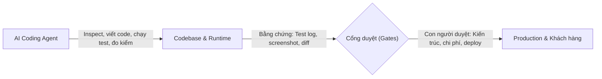
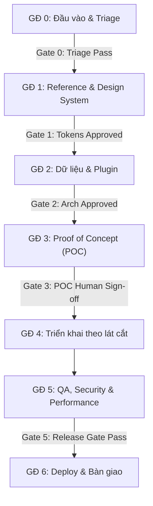
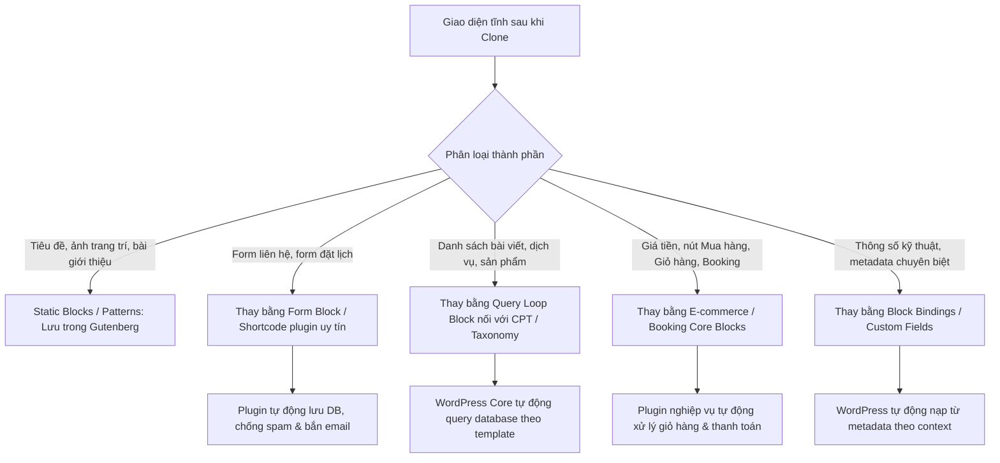

# QUY TRÌNH DEV WORDPRESS THỰC CHIẾN AGENCY/FREELANCE — AI-FIRST PLAYBOOK

## Từ brief đã chốt đến production, tái tạo bố cục tham khảo và bàn giao dễ quản trị

| Metadata | Giá trị quy chuẩn |
| :--- | :--- |
| **Loại tài liệu** | Global SOP / Global Engineering Playbook (Dùng lâu dài cho đa dự án) |
| **Đối tượng áp dụng** | Developer, Freelancer, Agency, Tech Lead, PM và AI Coding Agents |
| **Phạm vi** | Bắt đầu khi đội dev nhận brief/nội dung đã duyệt đến khi bàn giao & vận hành |
| **Tính khả chuyển** | Hoạt động độc lập môi trường (Windows, macOS, Linux, Docker, CI/CD) |
| **Nguyên tắc cốt lõi** | **Inspect before Assume** — Dạy cách tìm câu trả lời đúng, không hardcode giả định |

> **Quy tắc phân định tài liệu:**
> - **Global SOP (File này):** Định nghĩa *Cách thức làm việc, quy trình, tiêu chí ra quyết định, guardrails, quality gates và chuẩn mực nghiệm thu*.
> - **PROJECT_CONTEXT.md (Từng dự án):** Lưu trữ *Thông tin cụ thể của dự án đó* (WordPress version, PHP, database prefix, hosting, theme architecture, danh sách plugin, CPT, API contracts).

---

## MỤC LỤC

1. [Phạm vi, cách dùng và Phân loại rủi ro](#pham-vi-va-cach-dung)
2. [Triết lý AI-First có kiểm soát & AI Execution Contract](#triet-ly-ai-first)
3. [Hợp đồng đầu vào kỹ thuật và Bộ Artifacts](#hop-dong-dau-vao)
4. [Quy trình 7 giai đoạn từ Handoff đến Production](#quy-trinh-7-giai-doan)
5. [Cổng quyết định và Definition of Done (DoD)](#cong-quyet-dinh)
6. [Bộ quy tắc ranh giới cho AI Agent (Guardrails)](#quy-tac-ai-agent)
7. [Tái tạo bố cục từ website tham khảo (Reference Reconstruction)](#tai-tao-bo-cuc)
   - [Repo JCodesMore/ai-website-cloner-template](#repo-jcodesmore)
   - [Khi nào dùng cth9191/site-clone cho Motion & WebGL](#site-clone-nang-cao)
   - [Hậu tái tạo: Động hóa dữ liệu (Dynamic Data Binding)](#hau-tai-tao-dong-hoa)
   - [Clone thẳng về WordPress & Nguyên tắc No-code Replaceability](#clone-thang-wordpress-va-anh-no-code)
8. [Mô hình dữ liệu và Database Inspection](#kien-truc-wordpress)
   - [Nguyên tắc phân định ranh giới mã nguồn](#ranh-gioi-code)
   - [Quy trình Database Inspection & Data Ownership](#database-inspection)
   - [Khi nào dùng Core Tables vs Khi nào tạo Custom Table?](#core-vs-custom-tables)
   - [Request Lifecycle & Hooks (Actions & Filters)](#request-lifecycle-va-hooks)
   - [Mẫu ghi nhận quyết định kiến trúc (ADR)](#mau-adr)
9. [Chiến lược Plugin, Theme và Custom Code](#chon-plugin-theme-custom-code)
   - [Khung đánh giá Plugin (Plugin Evaluation Framework)](#plugin-evaluation-framework)
   - [Năng lực hạ tầng (Commodity) vs Nghiệp vụ đặc thù (Business Logic)](#commodity-vs-custom-logic)
   - [Thước đo quyết định trong 3 giây](#thuoc-do-quyet-dinh-3-giay)
   - [Chính sách mặc định: Gutenberg-first](#gutenberg-vs-elementor)
10. [Bảo mật WordPress (Hardening & Secure Coding)](#bao-mat-wordpress)
11. [Hiệu năng, Hình ảnh và Core Web Vitals](#performance-wordpress)
12. [Chiến lược kiểm thử (Testing Strategy)](#chien-luoc-kiem-thu)
13. [Môi trường Local, Quản lý Git/GitHub và Triển khai](#docker-staging-production)
    - [Nguyên tắc quản lý Git & Baseline .gitignore](#git-thuc-chien-wordpress)
    - [Cấu trúc Docker Compose Local mẫu](#docker-compose-local)
    - [Lệnh WP-CLI điều hành thường dùng](#docker-wp-cli-thuong-dung)
14. [Sao lưu, Giám sát và Xử lý sự cố](#backup-monitoring-incident)
15. [Bộ công cụ theo mục đích (Tooling Capabilities)](#bo-cong-cu)
16. [Prompt mẫu chuẩn cho AI Agent](#prompt-mau)
17. [Checklist bàn giao (Task-based Handover)](#checklist-ban-giao)
18. [Nguồn tham khảo chính thức](#nguon-va-phien-ban)

---

<a id="pham-vi-va-cach-dung"></a>

## 1. PHẠM VI, CÁCH DÙNG VÀ PHÂN LOẠI RỦI RO

### 1.1. Điểm bắt đầu
Quy trình bắt đầu khi đội dev nhận brief/nội dung đã duyệt từ khách hàng hoặc account. Tài liệu chuẩn hóa cách biến yêu cầu thành hệ thống WordPress ổn định, ủy quyền tối đa các tác vụ lặp lại cho AI Coding Agent, đồng thời đảm bảo sản phẩm bàn giao **dễ quản trị cho người không biết lập trình**.

### 1.2. Phân loại mức quy trình theo rủi ro dự án

| Loại hình website | Mức rủi ro | Trọng tâm kỹ thuật |
| :--- | :---: | :--- |
| **Doanh nghiệp / Giới thiệu / B2B Lead-gen** | Thấp | Tốc độ tải, chuẩn SEO, form thu lead, editor trực quan No-code |
| **Cửa hàng E-commerce đơn lẻ** | Trung bình | Giỏ hàng, thanh toán, bảo mật checkout, transactional email |
| **Dịch vụ Đặt lịch / Booking / Phòng khám** | Trung bình–Cao | Lịch trống (availability), quản lý slot, thông báo SMS/Email, idempotency |
| **Cổng Giáo dục / LMS / Khóa học** | Trung bình–Cao | Tiến độ học, phân quyền học viên/giảng viên, cấp chứng chỉ, streaming |
| **Marketplace / Nền tảng nhiều người bán** | Cao | Phân quyền vendor, hoa hồng, thanh toán payout, bảo mật tải cao |
| **Tích hợp phần mềm nội bộ (ERP, CRM, Kế toán)** | Cao | Webhook, REST API contract, idempotency, retry log, xử lý lỗi bất đồng bộ |

### 1.3. Luồng 10 bước thực thi chuẩn
```text
1. Nhận brief đã chốt & Inspect hiện trạng (Inspect before Assume)
2. AI kiểm tra codebase, môi trường runtime & tạo mới hoặc cập nhật PROJECT_CONTEXT.md
3. AI phân tích URL/screenshot tham khảo & lập Design Tokens
4. Đánh giá Plugin vs Custom Code; chốt Data Model & lập ADR nếu cần
5. Dựng 01 luồng mẫu hoàn chỉnh (Proof of Concept - POC)
6. Người phụ trách / Khách hàng nghiệm thu POC (Gate 3)
7. AI triển khai theo từng lát cắt độc lập (Vertical Slices)
8. QA đa trục dựa trên bằng chứng (Bảo mật, WCAG, Tốc độ, Usability)
9. Deploy Staging → Nghiệm thu Release Gate (Gate 5) → Production
10. Bàn giao kèm hồ sơ tác vụ No-code & bàn giao quyền quản trị
```

---

<a id="triet-ly-ai-first"></a>

## 2. TRIẾT LÝ AI-FIRST CÓ KIỂM SOÁT & AI EXECUTION CONTRACT



### 2.1. Nguyên tắc nền tảng

1. **Inspect before Assume (Khảo sát trước khi giả định):**
   AI không được tự suy đoán phiên bản hay kiến trúc mà phải tìm câu trả lời từ thực tế theo thứ tự ưu tiên:
   `Repository code` → `Project documentation` → `Runtime environment` → `Existing configuration` → `Existing database` → `Official docs` → `Human clarification`.
2. **Evidence-based Completion (Nghiệm thu bằng bằng chứng):**
   Một tác vụ chỉ được coi là hoàn thành khi có bằng chứng xác thực (test pass, lint sạch, screenshot giao diện, bản ghi database, response log, diff code). Không chấp nhận báo "Xong" chỉ vì vừa viết xong code.
3. **Failure & Blocker Rule (Quy tắc xử lý điểm nghẽn):**
   Khi thiếu thông tin trọng yếu ảnh hưởng đến kiến trúc, bảo mật, chi phí hoặc toàn vẹn dữ liệu:
   - Dừng ngay hành động rủi ro đó và ghi rõ lý do chặn (blocker).
   - Tuyệt đối không dùng giải pháp tạm thời mang tính phá hủy (destructive workaround).
   - Tiếp tục thực hiện các phần việc độc lập an toàn khác.
   - Báo cáo và yêu cầu Human Approval cho phần bị nghẽn.
4. **Hierarchy of Priorities (Thứ tự ưu tiên khi xung đột):**
   `Security → Data Integrity → Human Approval → Correctness → Maintainability → Performance → Convenience`

### 2.2. Hợp đồng hành vi của AI Agent (AI Agent Execution Contract)

| Cấp độ quyền hạn | Các hành vi tương ứng |
| :--- | :--- |
| **MẶC ĐỊNH ĐƯỢC PHÉP<br>(Default Allowed)** | - Đọc mã nguồn, logs, documentation, cấu hình local.<br>- Chạy tests, linter, static analysis, performance audit local.<br>- Chỉnh sửa custom theme (`client-theme`) và custom plugin (`client-core`) trong phạm vi task.<br>- Tạo mới tests, block patterns, migration script local, cập nhật tài liệu dự án.<br>- Khảo sát cấu trúc database local (read-only queries). |
| **BẮT BUỘC DUYỆT BỞI NGƯỜI<br>(Requires Human Approval)** | - Thay đổi cấu trúc database có tính phá hủy (DROP, TRUNCATE, xóa cột).<br>- Cài đặt plugin có phí, phát sinh chi phí bản quyền hoặc dịch vụ ngoài.<br>- Quyết định kiến trúc lớn (chọn builder, thay đổi data model cốt lõi).<br>- Cấu hình cổng thanh toán thật, thông tin thẻ tín dụng, API keys production.<br>- Thao tác triển khai lên máy chủ Production hoặc can thiệp DNS/Domain.<br>- Mọi thao tác có bán kính ảnh hưởng lớn (blast radius) khó đảo ngược. |
| **CẤM TUYỆT ĐỐI<br>(Strictly Forbidden - MUST NOT)** | - ❌ Sửa trực tiếp file trong WordPress Core (`wp-admin/`, `wp-includes/`, `index.php`).<br>- ❌ Sửa trực tiếp file của theme/plugin vendor bên thứ 3 (mất code khi update).<br>- ❌ Hardcode hình ảnh hoặc visual assets khiến khách hàng mất khả năng tự thay thế No-code.<br>- ❌ Commit file chứa mật khẩu, API keys, credentials (`.env`, `wp-config.php`) lên Git.<br>- ❌ Bypass các rào chắn bảo mật (tắt nonce, bỏ capability check) chỉ để code chạy được.<br>- ❌ Bỏ qua các tiêu chí thất bại của Release Gate để cố tình bàn giao.<br>- ❌ Tự ý xóa hoặc ghi đè dữ liệu trên môi trường Production. |

---

<a id="hop-dong-dau-vao"></a>

## 3. HỢP ĐỒNG ĐẦU VÀO KỸ THUẬT VÀ BỘ ARTIFACTS

### 3.1. Đầu vào tối thiểu trước khi bắt đầu code
- Danh sách URL/screenshot đại diện cho các template chính (Trang chủ, Chi tiết, Danh mục, Form) **nếu dự án có website tham khảo**.
- Danh sách tính năng và luồng nghiệp vụ bắt buộc phải có.
- Ma trận phân quyền: Phần nào khách hàng tự quản trị, phần nào khóa cố định để bảo vệ layout.
- Thông tin hạ tầng liên quan: Hosting, phiên bản PHP/MySQL hỗ trợ, phương thức gửi mail (SMTP), cổng thanh toán, CDN... **nếu nằm trong phạm vi (scope) dự án**.

### 3.2. Bộ Artifacts chuẩn mực của dự án

| Artifact | Trách nhiệm nội dung |
| :--- | :--- |
| `PROJECT_CONTEXT.md` | Bối cảnh kỹ thuật cụ thể của dự án: WP version, PHP, prefix DB, plugins đã duyệt, domain, CPT. |
| `IMPLEMENTATION_PLAN.md` | Kế hoạch chia nhỏ lát cắt (Vertical Slices), danh sách dependency và kế hoạch kiểm thử. |
| `PLUGIN_EVALUATION.md` | Báo cáo đánh giá plugin theo framework (Free vs Pro, bảo mật, lock-in, phương án dự phòng). |
| `DESIGN_SYSTEM.md` | Bảng Design tokens: bảng màu, typography, spacing, component inventory đã map vào `theme.json`. |
| `docs/decisions/ADR-*.md` | Ghi nhận các quyết định kiến trúc khó đảo ngược (Database model, Theme engine, Payment provider). |
| `TEST_REPORT.md` | Bằng chứng kiểm thử: kết quả smoke test, security checklist, Lighthouse audit, browser verification. |
| `RELEASE_RUNBOOK.md` | Quy trình deploy production: checklist backup, lệnh search-replace URL, kế hoạch rollback. |
| `HANDOVER.md` | Hướng dẫn vận hành theo tác vụ thực tế (Task-based) cho người không chuyên kỹ thuật. |

---

<a id="quy-trinh-7-giai-doan"></a>

## 4. QUY TRÌNH 7 GIAI ĐOẠN TỪ HANDOFF ĐẾN PRODUCTION



### GIAI ĐOẠN 0 — ĐẦU VÀO VÀ TRIAGE
- **Mục tiêu:** Khảo sát hiện trạng thực tế (Inspect) trước khi đưa ra bất kỳ quyết định kỹ thuật nào.
- **Hành động AI:** Xác định kiến trúc theme hiện tại, phiên bản WordPress/PHP/MySQL, kiểm tra repo Git, cấu hình Docker/local, lập danh sách các câu hỏi chặn kiến trúc.
- **Gate 0:** Brief rõ ràng, môi trường chạy được, không còn blocker kiến trúc hoặc chi phí license phát sinh.

### GIAI ĐOẠN 1 — REFERENCE VÀ DESIGN SYSTEM
- **Mục tiêu:** Chuyển website tham khảo thành đặc tả thiết kế hệ thống, tránh tạo HTML tĩnh rời rạc.
- **Hành động AI:** Bóc tách layout tokens (màu sắc, typography, spacing) map trực tiếp vào `theme.json`; lập danh mục thành phần giao diện (Component Inventory).
- **Gate 1:** Bảng Design Tokens và mapping layout được người phụ trách duyệt.

### GIAI ĐOẠN 2 — NỘI DUNG, DỮ LIỆU VÀ PLUGIN
- **Mục tiêu:** Quyết định chính xác dữ liệu sống ở đâu và khách hàng quản trị bằng cách nào trước khi code giao diện.
- **Hành động AI:** Phân loại nhu cầu → WP Core giải quyết được gì → Plugin nào gánh → Khoảng trống nào cần code PHP tùy biến.
- **Gate 2:** Kiến trúc dữ liệu và danh sách plugin được chốt kèm phương án dự phòng rủi ro.

### GIAI ĐOẠN 3 — PROOF OF CONCEPT (POC) VÀ VERTICAL SLICE
- **Mục tiêu:** Chứng minh giải pháp hoạt động thông suốt từ Admin đến Frontend trên 01 luồng nghiệp vụ đại diện.
- **Luồng kiểm chứng:** Nhập liệu Admin → Validation → Lưu DB → Render Frontend → Khách tự sửa thử bằng chuột.
- **Gate 3:** Người phụ trách / Khách hàng nghiệm thu trực tiếp trên trình duyệt trước khi mở rộng quy mô.

### GIAI ĐOẠN 4 — TRIỂN KHAI THEO TỪNG LÁT CẮT (VERTICAL SLICES)
- **Thứ tự ưu tiên:** Foundation (`theme.json`, header/footer) → Content Types & Fields → Các trang cốt lõi → Component dùng chung → Tích hợp & Tự động hóa → Rào chắn phân quyền quản trị.
- **Quy tắc:** Mỗi lát cắt phải là một đơn vị hoàn chỉnh, kiểm thử được độc lập và không làm gãy các phần khác.

### GIAI ĐOẠN 5 — QA, BẢO MẬT, ACCESSIBILITY VÀ HIỆU NĂNG
- **Kiểm thử đa trục:** Chức năng nghiệp vụ, Responsive thiết bị thật, Phân quyền Roles, Bảo mật (nonce, escaping, capabilities), Accessibility (WCAG cơ bản), SEO technical, và Hiệu năng (Lighthouse/profiling).
- **Gate 5:** Báo cáo kiểm thử đạt chuẩn nghiệm thu kỹ thuật; không còn lỗi bảo mật hay crash.

### GIAI ĐOẠN 6 — DEPLOY PRODUCTION, BÀN GIAO VÀ VẬN HÀNH
- **Mục tiêu:** Triển khai an toàn không downtime, bàn giao hệ thống kèm hồ sơ tác vụ thực tế cho khách hàng.
- **Gate 6:** Khách đăng nhập thành công, quyền truy cập được bàn giao, MFA được thiết lập và checklist handover hoàn tất.

---

<a id="cong-quyet-dinh"></a>

## 5. CỔNG QUYẾT ĐỊNH VÀ DEFINITION OF DONE (DoD)

| Cổng kiểm duyệt | Tiêu chí vượt qua (Definition of Done) | Người có thẩm quyền duyệt |
| :--- | :--- | :---: |
| **Gate 0: Triage** | Môi trường dev chạy được; brief đủ thông tin; không còn câu hỏi chặn kiến trúc. | Tech Lead |
| **Gate 1: Design Tokens** | Bảng màu, typography, container đã map vào `theme.json`; component inventory đủ. | Designer / Tech Lead |
| **Gate 2: Architecture** | Data model rõ ràng; danh sách plugin chốt kèm đánh giá lock-in và chi phí. | Tech Lead / PM |
| **Gate 3: POC** | Luồng đại diện thông suốt từ Admin đến Frontend; kiểm chứng No-code replaceability đạt. | Product Owner / Khách hàng |
| **Gate 4: Feature Slices** | Mỗi lát cắt có test pass, không lỗi runtime, đạt tiêu chuẩn visual comparison. | Tech Lead |
| **Gate 5: Release Gate** | Security check sạch; Pre-production audit đạt chuẩn; backup & rollback plan sẵn sàng. | Tech Lead / DevOps |
| **Gate 6: Handover** | Khách đăng nhập được; tài khoản có MFA; video hướng dẫn tác vụ No-code đã gửi; bàn giao quyền quản trị hoàn tất. | Account / Khách hàng |

---

<a id="quy-tac-ai-agent"></a>

## 6. BỘ QUY TẮC RANH GIỚI CHO AI AGENT (GUARDRAILS)

| Quy tắc hành vi | Phân loại | Chuẩn mực thực thi |
| :--- | :---: | :--- |
| **Sửa WordPress Core** | ❌ **MUST NOT** | Tuyệt đối không chỉnh sửa bất kỳ file nào trong `wp-admin/`, `wp-includes/`, `index.php`. |
| **Sửa trực tiếp Plugin/Theme vendor** | ❌ **MUST NOT** | Mọi tùy biến phải thông qua Child Theme, Hooks hoặc Custom Plugin riêng. |
| **Hardcode visual assets tĩnh** | ❌ **MUST NOT** | Hardcode visual asset xuất hiện trên frontend theo cách buộc người vận hành phải sửa source code để thay thế. Mọi visual asset phải có cơ chế quản trị No-code phù hợp; ngoại lệ kỹ thuật phải được ghi nhận bằng ADR. |
| **Commit secrets & files rác** | ❌ **MUST NOT** | Không đưa `.env`, `wp-config.php`, runtime `uploads/`, database dump lên Git. |
| **Lạm dụng CSS `!important`** | ❌ **MUST NOT** | Không dùng `!important` làm tê liệt Inspector Controls và khả năng đổi màu của khách. |
| **Bypass bảo mật** | ❌ **MUST NOT** | Không tắt nonce, không bỏ qua sanitize/escape hay capability check để code chạy nhanh. |
| **Thao tác dữ liệu Production** | ⚠️ **APPROVAL** | Bắt buộc có Human Approval, bản backup mới nhất và rollback plan trước khi thực thi. |
| **Cài đặt plugin trùng trách nhiệm** | ❌ **MUST NOT** | Không cài 2 plugin sở hữu cùng một vai trò (ví dụ: 2 plugin SEO, 2 plugin Cache). |
| **Khảo sát trước khi giả định** | ✅ **MUST** | Luôn inspect repository, database và runtime hiện tại trước khi đề xuất giải pháp. |
| **Nghiệm thu bằng bằng chứng** | ✅ **MUST** | Cung cấp bằng chứng kiểm thử (log, diff, screenshot, query) cho mọi task hoàn thành. |

---

<a id="tai-tao-bo-cuc"></a>

## 7. TÁI TẠO BỐ CỤC TỪ WEBSITE THAM KHẢO (REFERENCE RECONSTRUCTION)

<a id="repo-jcodesmore"></a>

### 7.1. Repo `ai-website-cloner-template` (JCodesMore)
Repo [JCodesMore/ai-website-cloner-template](https://github.com/JCodesMore/ai-website-cloner-template) cung cấp bộ khung phân tích giao diện từ URL bằng lệnh `/clone-website <urls>`.

- **Mục đích:** Bóc tách layout rhythm, phân tích typography scale, bảng màu, spacing và trạng thái tương tác.
- **Lưu ý kiến trúc:** Đầu ra mặc định của repo này là Next.js prototype. Khi làm dự án WordPress, ta chỉ tận dụng **kỹ thuật quan sát và đặc tả component**, tuyệt đối **không bê nguyên mã nguồn Next.js vào theme WordPress**.

<a id="site-clone-nang-cao"></a>

### 7.2. Khi nào dùng `cth9191/site-clone` cho Motion & WebGL?
Repo [cth9191/site-clone](https://github.com/cth9191/site-clone) là bộ skill chuyên sâu cho website có tương tác phức tạp (GSAP, ScrollTrigger, WebGL, Canvas shaders).

- **Cách dùng:** Sử dụng lệnh `/clone-site <url> --analyze-only` để trích xuất `TEARDOWN.md`, `motion.json` và surface map.
- **Quy tắc:** Chỉ giữ lại những hiệu ứng animation thật sự phục vụ trải nghiệm người dùng; bắt buộc phải đo kiểm hiệu năng thực tế trên thiết bị di động.

<a id="hau-tai-tao-dong-hoa"></a>

### 7.3. Hậu tái tạo: Động hóa dữ liệu (Dynamic Data Binding)

Khác với mô hình MVC thuần nơi lập trình viên phải tự viết bảng database và câu lệnh CRUD từ đầu:
- **WordPress Core và hệ sinh thái Plugins đã có sẵn mô hình dữ liệu và toàn bộ Backend CRUD APIs.**
- **Nhiệm vụ trọng tâm là Động hóa giao diện:** Thay thế các phần tử HTML tĩnh bằng **Dynamic Data Anchors**:



<a id="clone-thang-wordpress-va-anh-no-code"></a>

### 7.4. Clone thẳng về WordPress & Nguyên tắc No-code Replaceability

#### 1. Khuyến nghị triển khai chuẩn Agency
Yêu cầu AI Coding Agent phân tích trực tiếp HTML/CSS từ URL tham khảo và **xuất thẳng ra Gutenberg Block Pattern** (`.html` hoặc `.php`) lưu vào thư mục theme (`wp-content/themes/client-theme/patterns/`). Bỏ qua prototype trung gian khi không mang lại giá trị kiểm chứng riêng, giúp giảm duplication và thời gian chuyển đổi implementation.

#### 2. No-code Replaceability là Architectural Requirement
Khách hàng không biết lập trình **bắt buộc phải tự thay đổi được mọi visual asset** xuất hiện trên frontend (Logo, banner, ảnh đại diện, ảnh bài viết, background hero, hình minh họa) mà **không bao giờ phải chạm vào mã nguồn**.

#### 3. Quy tắc kỹ thuật bắt buộc:
- ❌ **MUST NOT:** Không hardcode thẻ `` với URL cố định hoặc viết CSS `background-image: url(...)` cứng trong file stylesheet.
- ✅ **MUST:** Luôn dùng các thành phần chuẩn của Block Editor:
  - **Site Logo Block (`<!-- wp:site-logo -->`)** cho logo doanh nghiệp.
  - **Core Image Block (`<!-- wp:image -->`)** cho hình ảnh nội dung.
  - **Cover Block (`<!-- wp:cover -->`)** cho banner nền kèm chữ đè lên.
  - **Post Featured Image (`<!-- wp:post-featured-image -->`)** cho ảnh đại diện bài viết/CPT.
  - **Block Bindings API** hoặc **Custom Fields** khi cần gán ảnh động theo dữ liệu.
- **Thao tác khách hàng 3 giây:** Nhấp vào ảnh → Bấm nút **"Replace" (Thay thế)** trên thanh công cụ → Chọn ảnh mới từ Media Library hoặc Upload. Ảnh mới tự động thế chỗ với đúng kích thước và responsive chuẩn.
- *Ngoại lệ kỹ thuật:* Nếu có thành phần đồ họa đặc thù (SVG sprite phức tạp, Canvas WebGL) không thể dùng block chuẩn, Agent bắt buộc phải ghi nhận lý do vào ADR và cung cấp phương án cấu hình trực quan qua Customizer/Site Editor.

---

<a id="kien-truc-wordpress"></a>

## 8. MÔ HÌNH DỮ LIỆU VÀ DATABASE INSPECTION

<a id="ranh-gioi-code"></a>

### 8.1. Nguyên tắc phân định ranh giới mã nguồn
```text
wordpress-root/
├── wp-admin/                 # WordPress Core — CẤM SỬA
├── wp-includes/              # WordPress Core — CẤM SỬA
├── wp-config.php             # Cấu hình runtime; không commit mật khẩu
└── wp-content/
    ├── plugins/
    │   └── client-core/      # Nghiệp vụ riêng, CPT, API, Cron, Webhook (Quản lý bằng Git)
    ├── themes/
    │   └── client-theme/     # Templates, Block Patterns, theme.json, Assets (Quản lý bằng Git)
    └── uploads/              # Runtime media của user; KHÔNG đưa vào Git
```

<a id="database-inspection"></a>

### 8.2. Quy trình Database Inspection & Data Ownership
Trước khi quyết định nơi lưu trữ hoặc truy vấn dữ liệu, AI Agent bắt buộc phải **inspect schema thực tế của dự án** thay vì giả định:

- **Khảo sát quyền sở hữu dữ liệu (Data Ownership):**
  - **Core-owned data:** Dữ liệu content (posts, pages, CPT), taxonomy terms, metadata và configuration chuẩn của WordPress Core.
  - **Plugin-owned data:** Dữ liệu do plugin nghiệp vụ quản lý (e-commerce, form submissions, booking). **Nguyên tắc bất biến:** Khi cần thao tác dữ liệu do plugin quản lý, **bắt buộc ưu tiên dùng API, CRUD methods hoặc Hooks chính thức của plugin**, tuyệt đối không tự ý viết query ghi trực tiếp vào bảng của plugin.
  - **Project-owned / Custom data:** Dữ liệu đặc thù riêng của dự án chưa có thành phần nào quản lý.
- **Nguyên tắc Inspect trước khi hành động:**
  - Xác định table prefix thực tế (từ `wp-config.php` hoặc runtime query; không mặc định là `wp_`).
  - Phân loại bản chất dữ liệu: Content, Metadata, Configuration, hay Transactional/Business data để chọn cơ chế lưu trữ tương thích.
  - Không giả định tên bảng, prefix hoặc storage model dựa trên kinh nghiệm từ project khác.

<a id="core-vs-custom-tables"></a>

### 8.3. Khi nào dùng Core Tables vs Khi nào tạo Custom Table?

- **Quy tắc chống anti-pattern:** Không tự tiện tạo custom table chỉ vì quen tay với kiến trúc MVC thuần (Laravel, Spring). Tận dụng tối đa CPT và Postmeta giúp bạn thừa hưởng miễn phí hệ thống phân quyền, REST API, GUI quản trị, preview và revision của WordPress.
- **Khi nào CẦN tạo Custom Table riêng?**
  Agent đánh giá dựa trên các tiêu chí kỹ thuật:
  - *Query volume & Tần suất ghi cao:* Dữ liệu sinh ra liên tục (log giao dịch, telemetry, GPS tracking).
  - *Yêu cầu đánh index phức tạp:* Cần truy vấn nhiều trường đồng thời mà `wp_postmeta` (cấu trúc EAV key-value) gây chậm nghiêm trọng.
  - *Data size lớn & Tách biệt vòng đời:* Dữ liệu tạm thời hoặc có chính sách dọn dẹp riêng không muốn làm phình bảng `wp_posts`.
- **Ràng buộc:** Mọi quyết định tạo Custom Table bắt buộc phải có **ADR ghi nhận lý do** và phương án migrate/cleanup dữ liệu.

<a id="request-lifecycle-va-hooks"></a>

### 8.4. Request Lifecycle & Hooks (Actions & Filters)
Lập trình viên và AI chỉ can thiệp vào luồng xử lý của WordPress thông qua hệ thống **Hooks**:
- **Action (`add_action`):** Thực thi thêm logic tại một thời điểm nhất định (bắn webhook, gửi mail, ghi log). Callback không return giá trị.
- **Filter (`add_filter`):** Nhận giá trị đầu vào, biến đổi nội dung và **bắt buộc phải return** giá trị đó.

```php
<?php
/**
 * Custom Post Type mẫu đặt trong wp-content/plugins/client-core/client-core.php
 */
add_action( 'init', function(): void {
    register_post_type( 'client_item', array(
        'labels'       => array( 'name' => __( 'Items', 'client-core' ) ),
        'public'       => true,
        'has_archive'  => true,
        'show_in_rest' => true, // BẮT BUỘC để kích hoạt Gutenberg Block Editor
        'supports'     => array( 'title', 'editor', 'thumbnail', 'custom-fields' ),
    ) );
} );
```

<a id="mau-adr"></a>

### 8.5. Mẫu ghi nhận quyết định kiến trúc (ADR)
Tạo file `docs/decisions/ADR-001-ten-quyet-dinh.md` cho mọi quyết định khó đảo ngược:
```markdown
# ADR-001: [Tên quyết định]
## Status: Proposed | Accepted | Superseded
## Context: Bối cảnh nghiệp vụ, yêu cầu kỹ thuật và các ràng buộc hiện tại.
## Decision: Quyết định lựa chọn và lý do kỹ thuật chi tiết.
## Consequences: Chi phí bản quyền, ảnh hưởng hiệu năng, rủi ro lock-in và phương án thay thế.
```

---

<a id="chon-plugin-theme-custom-code"></a>

## 9. CHIẾN LƯỢC PLUGIN, THEME VÀ CUSTOM CODE

<a id="plugin-evaluation-framework"></a>

### 9.1. Khung đánh giá Plugin (Plugin Evaluation Framework)
Không dùng một tiêu chí đơn lẻ (như số lượt cài đặt) để kết luận. AI Agent và Developer đánh giá plugin dựa trên bộ tiêu chí đa trục:
1. **Maintainer & Uy tín nhà phát triển:** Do đơn vị uy tín phát triển, duy trì thường xuyên trong 3–6 tháng gần nhất.
2. **Lịch sử bảo mật (Vulnerabilities Track Record):** Kiểm tra lịch sử lỗ hổng trên WPScan/CVE; đánh giá tốc độ vá lỗi của đội ngũ phát triển.
3. **Tương thích:** Tương thích với phiên bản WordPress và PHP của dự án; hỗ trợ chuẩn Gutenberg.
4. **Data Portability & Rủi ro Lock-in:** Dữ liệu có thể export sạch (CSV, JSON, SQL) khi cần chuyển đổi hay bị mã hóa/khóa chặt trong plugin?
5. **Ảnh hưởng hiệu năng:** Plugin có nạp CSS/JS tràn lan trên toàn bộ các trang frontend không thuộc phạm vi hoạt động của nó hay không?
6. **Extensibility (Khả năng mở rộng):** Có đầy đủ Hooks (Actions/Filters) hoặc REST API để custom code can thiệp khi cần?
7. **Chi phí & Bản quyền:** Bản Free có hoàn thiện trọn vẹn luồng chính không? Nếu cần bản Pro, chi phí gia hạn hàng năm là bao nhiêu?
8. **Active Installations:** Xem như một tín hiệu tham khảo về độ phổ biến cộng đồng, không phải thước đo duy nhất.

<a id="commodity-vs-custom-logic"></a>

### 9.2. Năng lực hạ tầng (Commodity) vs Nghiệp vụ đặc thù (Business Logic)

#### Nhóm A: Ưu tiên giải pháp có sẵn (Commodity Capabilities)
Áp dụng cho các bài toán hạ tầng phổ biến, đòi hỏi kiểm thử bảo mật khắt khe và tuân thủ tiêu chuẩn ngành:
- **Giao dịch, E-commerce & Booking:** WooCommerce, MotoPress Booking, Amelia, các cổng thanh toán chính thức (VNPay, MoMo, Stripe). *Tự viết code cho phần này là rủi ro lớn về bảo mật tài chính.*
- **Form thu thập dữ liệu & Chống spam:** Fluent Forms, WPForms, Gravity Forms. Khách hàng tự thêm sửa trường, tích hợp Turnstile/reCAPTCHA, xuất dữ liệu.
- **Tối ưu hạ tầng, Cache, SEO & Mail:** RankMath/Yoast (SEO), LiteSpeed Cache/WP Rocket (Tốc độ), FluentSMTP (Đảm bảo tỷ lệ gửi mail).

#### Nhóm B: Bắt buộc hoặc Khuyến nghị tự code Custom Plugin (`client-core`)
Chỉ viết code tùy biến cho các logic tạo nên sự khác biệt của doanh nghiệp:
- **Quy tắc nghiệp vụ độc quyền:** Công thức tính giá đặc thù, thuật toán chiết khấu nhiều tầng riêng biệt.
- **Tích hợp phần mềm nội bộ:** Kết nối API hai chiều với hệ thống ERP, CRM, phần mềm kế toán của khách hàng.
- **Đăng ký CPT & Taxonomy:** Khai báo bằng code trong custom plugin giúp hệ thống siêu nhẹ, không phụ thuộc plugin tạo CPT ngoài.
- **Micro-features:** Tinh chỉnh nhỏ qua Hook (thay đổi text, chèn pixel theo dõi).

<a id="thuoc-do-quyet-dinh-3-giay"></a>

### 9.3. Thước đo quyết định trong 3 giây (Decision Rule)

Chuỗi ưu tiên kiến trúc: **Core / Gutenberg → Existing Trusted Capability → Custom Plugin Code**

| Câu hỏi tự vấn theo thứ tự ưu tiên | Giải pháp chuẩn |
| :--- | :--- |
| **1. WordPress Core & Gutenberg có sẵn tính năng và đáp ứng đủ nhu cầu quản trị không?** *(Đổi màu, đổi chữ, thay ảnh, bố cục cột, query bài viết/CPT)* | → **BẮT BUỘC dùng WordPress Core / Gutenberg** (Không cài plugin thừa) |
| **2. Năng lực hạ tầng phức tạp, nhạy cảm hoặc cần GUI quản trị riêng mà Core chưa có?** *(Thanh toán, cổng thanh toán, form phức tạp + chống spam, SEO, Cache, SMTP)* | → **Ưu tiên dùng Plugin uy tín đã kiểm chứng** (Nhóm Commodity) |
| **3. Nghiệp vụ logic độc quyền, công thức tính toán chạy ngầm ở backend (không cần kéo thả UI)?** | → **Tự code Custom Plugin (`client-core`)** |
| **4. Cần tích hợp REST API / Webhook hai chiều với phần mềm nội bộ của doanh nghiệp?** | → **Tự code Custom Plugin (`client-core`)** |

<a id="gutenberg-vs-elementor"></a>

### 9.4. Chính sách mặc định: Gutenberg-first
- **Chính sách dự án mới (Greenfield):** Lựa chọn mặc định luôn là **Gutenberg Core / Block Theme** kết hợp thư viện block native nhẹ (như Spectra/GenerateBlocks khi cần). Lý do: Mã nguồn tinh gọn, hiệu năng cao, không phát sinh chi phí bản quyền định kỳ, và đảm bảo tính tương thích lâu dài với lộ trình phát triển của WordPress Core.
- **Quan điểm về Elementor & Page Builders khác:** Không phủ nhận giá trị tạo mẫu nhanh, nhưng Elementor tạo cấu trúc DOM lồng nhau phức tạp ("Div soup"), nạp tài nguyên nặng và gây rủi ro phụ thuộc nền tảng (Vendor Lock-in).
- **Các trường hợp ngoại lệ cho phép dùng Elementor:**
  - Nhận bảo trì hoặc mở rộng website di sản (legacy) đang vận hành ổn định trên Elementor.
  - Khách hàng có sẵn đội ngũ vận hành nội bộ đã thành thạo Elementor và yêu cầu bắt buộc bằng văn bản.
  - Chi phí đập đi xây lại vượt quá ngân sách hoặc thời hạn bàn giao của dự án.
  - *Ràng buộc:* Mọi ngoại lệ sử dụng Page Builder ngoài Gutenberg phải được ghi nhận chính thức bằng **ADR**.

---

<a id="bao-mat-wordpress"></a>

## 10. BẢO MẬT WORDPRESS (HARDENING & SECURE CODING)

### 10.1. Mười nguyên tắc Secure Coding bất biến (MUST FOLLOW)
1. **Validate Input:** Kiểm tra kiểu dữ liệu và tính hợp lệ trước khi xử lý.
2. **Sanitize Data:** Luôn làm sạch dữ liệu trước khi ghi vào Database (`sanitize_text_field()`, `sanitize_email()`, `absint()`).
3. **Escape Output theo ngữ cảnh:** Luôn escape dữ liệu ngay trước khi render ra màn hình:
   - Text thuần: `esc_html( $text )`
   - Thuộc tính HTML: `esc_attr( $attr )`
   - Đường dẫn liên kết: `esc_url( $url )`
   - Đoạn mã HTML phong phú: `wp_kses_post( $html )`
4. **Kiểm tra quyền hạn (Capability Check):** Luôn dùng `current_user_can()` trước khi thực thi tác vụ quản trị.
5. **Chống CSRF:** Tạo và kiểm tra Nonce cho mọi form và Ajax request (`wp_create_nonce()`, `check_admin_referer()`, `check_ajax_referer()`).
6. **Truy vấn SQL an toàn:** Tuyệt đối không nối chuỗi SQL trực tiếp; bắt buộc dùng `$wpdb->prepare()`.
7. **Bảo mật REST Route:** Luôn khai báo tường minh tham số `permission_callback` cho mọi custom REST API endpoint.
8. **Kiểm soát tệp tải lên:** Giới hạn MIME type hợp lệ, khống chế dung lượng tối đa và đổi tên tệp ngẫu nhiên an toàn.
9. **Xác thực Webhook:** Luôn kiểm tra chữ ký bí mật (HMAC Signature) và timestamp để chống tấn công phát lại (Replay attack).
10. **Chống SSRF:** Dùng `wp_safe_remote_get()` / `wp_safe_remote_post()` với timeout giới hạn khi gửi request ra bên ngoài.

---

<a id="performance-wordpress"></a>

## 11. HIỆU NĂNG, HÌNH ẢNH VÀ CORE WEB VITALS

### 11.1. Mục tiêu đo kiểm và Nguyên tắc đánh giá
- **Pre-production (Môi trường Dev / Staging):** Sử dụng Lighthouse, profiling công cụ trình duyệt và automated smoke test để phát hiện sớm các vấn đề:
  - **LCP (Largest Contentful Paint) <= 2.5s:** Tối ưu ảnh Hero, nén định dạng WebP/AVIF, loại bỏ CSS/JS chặn render.
  - **CLS (Cumulative Layout Shift) <= 0.1:** Luôn chỉ định kích thước tường minh (`width`, `height`) cho hình ảnh và video container.
  - **INP (Interaction to Next Paint) <= 200ms:** Giảm thiểu công việc thực thi trên main thread của JavaScript.
- **Production Verification:** Nhận thức rõ rằng một lần chạy Lighthouse trên local không chứng minh được hiệu năng production. Khi website có traffic thực tế, bắt buộc theo dõi **Field Data (CrUX, RUM hoặc APM monitoring)** để đánh giá trải nghiệm người dùng thực.

---

<a id="chien-luoc-kiem-thu"></a>

## 12. CHIẾN LƯỢC KIỂM THỬ (TESTING STRATEGY)

Một tính năng chỉ được xem là hoàn tất khi có đầy đủ bằng chứng kiểm thử:
1. **Static Analysis & Code Quality:** Kiểm tra cú pháp PHP và tuân thủ WordPress Coding Standards (WPCS).
2. **Functional Verification:** Kiểm thử luồng gửi form, thông báo email, thanh toán sandbox và tìm kiếm trên nhiều kích thước màn hình.
3. **Admin Usability Verification:** Đóng vai trò người dùng có quyền Editor/Shop Manager để kiểm chứng khả năng tự cập nhật nội dung mà không gặp lỗi layout hay phụ thuộc vào quyền Admin tối cao.

---

<a id="docker-staging-production"></a>

## 13. MÔI TRƯỜNG LOCAL, QUẢN LÝ GIT/GITHUB VÀ TRIỂN KHAI

<a id="git-thuc-chien-wordpress"></a>

### 13.1. Nguyên tắc quản lý Git & Baseline `.gitignore`

#### Nguyên tắc vàng về phân định mã nguồn
- ❌ **KHÔNG đưa vào Git:** Mã nguồn Core (`wp-admin/`, `wp-includes/`), thư mục hình ảnh do user upload (`wp-content/uploads/`), database data (`mysql_data/`), file cấu hình chứa secrets (`.env`, `wp-config.php`), và các plugin/theme bên thứ 3 tải từ kho chính thức.
- ✅ **Chỉ đưa vào Git:** File cấu hình môi trường (`docker-compose.yml`, `README.md`), tài liệu dự án, Custom Theme (`client-theme`) và Custom Plugin (`client-core`).

#### File mẫu baseline `.gitignore` (Agent cần inspect repo thực tế trước khi áp dụng)
```gitignore
# 1. BẢO MẬT & MẬT KHẨU CÁ NHÂN
.env
.env.*
wp-config.php

# 2. RUNTIME DATABASE & DOCKER VOLUMES
mysql_data/
*.sql
*.sql.gz

# 3. WORDPRESS CORE & RUNTIME ASSETS
wp-admin/
wp-includes/
wp-content/uploads/
wp-content/cache/
wp-content/upgrade/

# 4. DEPENDENCIES BÊN THỨ 3 (Chỉ track code do đội dev tự viết)
wp-content/plugins/*
!wp-content/plugins/client-core/
!wp-content/plugins/client-core/**

wp-content/themes/*
!wp-content/themes/client-theme/
!wp-content/themes/client-theme/**

# 5. OS & IDE TRASH
.DS_Store
Thumbs.db
.vscode/
.idea/
node_modules/
```

#### Chuỗi lệnh Git chuẩn mực đẩy dự án
```bash
git init
git branch -M main
git status
git add .
git commit -m "feat: initial project structure and documentation"
git remote add origin <REMOTE_REPOSITORY_URL>
git push -u origin main
```

<a id="docker-compose-local"></a>

### 13.2. Cấu trúc Docker Compose Local mẫu
Tham chiếu file cấu hình local tiêu chuẩn tại `./docker-compose.yml` gồm các dịch vụ thiết yếu:
- `wordpress`: Web server phục vụ ứng dụng tại cổng local (ví dụ: `http://localhost:8888`).
- `db`: Cơ sở dữ liệu MySQL / MariaDB, ánh xạ cổng để công cụ quản trị kết nối.
- `mailpit`: Dịch vụ bắt toàn bộ email gửi ra local (kiểm tra giao diện email tại `http://localhost:8025`).
- `wpcli`: Container hỗ trợ thực thi dòng lệnh WordPress tự động hóa.

<a id="docker-wp-cli-thuong-dung"></a>

### 13.3. Lệnh WP-CLI điều hành thường dùng
```bash
# Kiểm tra trạng thái hệ thống plugin
docker compose run --rm wpcli plugin status

# Tìm kiếm và thay thế URL an toàn (luôn chạy --dry-run trước)
docker compose run --rm wpcli search-replace 'http://localhost:8888' 'https://example.com' --all-tables-with-prefix --dry-run

# Dọn dẹp cache transients
docker compose run --rm wpcli transient delete --all
```

---

<a id="backup-monitoring-incident"></a>

## 14. SAO LƯU, GIÁM SÁT VÀ XỬ LÝ SỰ CỐ

- **Sao lưu độc lập:** Luôn tạo bản sao lưu toàn diện (Database dump + thư mục `uploads/` + custom code) và lưu trữ tách biệt khỏi máy chủ web trước khi thực hiện bất kỳ thay đổi nào trên Production.
- **Xử lý sự cố lỗi trắng trang (White Screen of Death - WSOD):**
  1. Kiểm tra log lỗi tại `wp-content/debug.log` hoặc web server error log.
  2. Nếu nghi ngờ do plugin gây xung đột, đổi tên thư mục plugin tương ứng qua SSH/CLI hoặc dùng lệnh `wp plugin deactivate <slug>` để khôi phục quyền truy cập tức thì.

---

<a id="bo-cong-cu"></a>

## 15. BỘ CÔNG CỤ THEO MỤC ĐÍCH (TOOLING CAPABILITIES)

Global SOP định nghĩa **Năng lực kỹ thuật theo nhu cầu và mức rủi ro của dự án (Risk/Scope-based Capabilities)** thay vì ép buộc mọi dự án phải cài đặt đủ toàn bộ công cụ. Các công cụ liệt kê là ví dụ minh họa phổ biến:

### 15.1. Năng lực nền tảng (Baseline Capabilities — Mọi dự án)
- **Local DB Inspection (DBeaver, TablePlus, phpMyAdmin, WP-CLI):** Khảo sát cấu trúc schema thực tế, quan sát dữ liệu ghi nhận của CPT và Plugin.
- **Code Quality & Static Analysis (PHP_CodeSniffer / WPCS, PHPStan):** Đảm bảo mã nguồn tuân thủ tiêu chuẩn an toàn của WordPress.
- **Functional & Usability Verification (Trình duyệt thực tế đa viewport):** Kiểm thử luồng quản trị No-code và trải nghiệm người dùng cuối.

### 15.2. Năng lực theo phạm vi (Conditional Capabilities — Khi dự án yêu cầu)
- **Local Email Capture (Mailpit, MailHog, WP Mail Logging):** *Cần thiết khi dự án có luồng gửi email giao dịch, thông báo hoặc xác nhận đơn hàng/booking.*
- **Public Webhook Tunnel (Cloudflare Tunnel, Ngrok):** *Cần thiết khi phát triển và kiểm thử tích hợp nhận webhook từ bên thứ 3 (cổng thanh toán, CRM).*
- **Load / Smoke Testing (k6, Apache Bench, Autocannon):** *Khuyến nghị cho dự án có rủi ro cao, chịu tải lớn hoặc có chiến dịch marketing quy mô lớn.*

---

<a id="prompt-mau"></a>

## 16. PROMPT MẪU CHUẨN CHO AI AGENT

### 16.1. Prompt Khảo sát Codebase (Triage)
> "Khảo sát toàn bộ repository và môi trường runtime hiện tại (Inspect before Assume). Hãy phân tích: kiến trúc theme, phiên bản PHP/WP, xác định data model, data ownership và storage mechanisms liên quan đến scope, danh sách plugin và trạng thái Git. Tạo mới hoặc cập nhật tài liệu `PROJECT_CONTEXT.md` ngắn gọn nêu rõ hiện trạng, rủi ro tiềm ẩn và đề xuất kế hoạch lát cắt đầu tiên kèm bằng chứng kiểm chứng."

### 16.2. Prompt Tái tạo Reference & Xuất Block Pattern
> "Phân tích bố cục và design tokens từ URL tham khảo này. Hãy tạo thành một Gutenberg Block Pattern chuẩn lưu vào `wp-content/themes/client-theme/patterns/feature.php`. Ưu tiên sử dụng Core Blocks (`<!-- wp:group -->`, `<!-- wp:image -->`, `<!-- wp:columns -->`); chỉ sử dụng block/plugin/custom implementation khác khi Core không đáp ứng requirement và phải nêu rõ lý do. Đảm bảo đáp ứng nguyên tắc No-code Replaceability để khách hàng có thể tự thay ảnh bằng nút Replace mà không vỡ bố cục."

### 16.3. Prompt Rà soát Bảo mật & Code Review
> "Rà soát toàn bộ mã nguồn tùy biến trong `client-core/` và `client-theme/` theo 10 nguyên tắc Secure Coding của Global SOP. Kiểm tra: Nonce verification, Input sanitization, Output escaping (`esc_html`, `esc_attr`, `esc_url`), Capability checks, và SQL queries với `$wpdb->prepare()`. Báo cáo cụ thể từng file, dòng code, bằng chứng rủi ro và mã sửa chữa."

---

<a id="checklist-ban-giao"></a>

## 17. CHECKLIST BÀN GIAO (TASK-BASED HANDOVER)

- [ ] **Bảo mật tài khoản:** Tạo tài khoản riêng cho khách hàng, kích hoạt xác thực hai yếu tố (MFA), thu hồi toàn bộ tài khoản dev tạm thời.
- [ ] **Tự chủ No-code:** Nghiệm thu thực tế: Khách hàng tự thay đổi được logo, hình ảnh, văn bản và màu sắc mà không làm xô lệch bố cục.
- [ ] **Hạ tầng gửi nhận Mail:** Thiết lập SMTP production chính thức và thực hiện gửi thử email thực tế thành công.
- [ ] **Bảo vệ cấu trúc giao diện:** Khóa các khung layout cốt lõi bằng cơ chế `templateLock: "contentOnly"`.
- [ ] **Sao lưu tự động:** Kích hoạt lịch trình sao lưu tự động ra bộ lưu trữ đám mây độc lập.
- [ ] **Tài liệu theo tác vụ:** Bàn giao tài liệu hướng dẫn tác vụ (`HANDOVER.md`) và video ngắn (1–2 phút) hướng dẫn thao tác thường ngày.

---

<a id="nguon-va-phien-ban"></a>

## 18. NGUỒN THAM KHẢO CHÍNH THỨC

- **WordPress Developer Resources:** [developer.wordpress.org](https://developer.wordpress.org/)
- **Theme & Block Editor Handbooks:** [developer.wordpress.org/block-editor](https://developer.wordpress.org/block-editor/)
- **WordPress Security APIs:** [developer.wordpress.org/apis/security](https://developer.wordpress.org/apis/security/)
- **JCodesMore Website Cloner Template:** [github.com/JCodesMore/ai-website-cloner-template](https://github.com/JCodesMore/ai-website-cloner-template)
- **cth9191 Site Clone (Motion & WebGL):** [github.com/cth9191/site-clone](https://github.com/cth9191/site-clone)
- **Docker Official WordPress Image:** [hub.docker.com/_/wordpress](https://hub.docker.com/_/wordpress)
- **Mailpit Documentation:** [mailpit.axllent.org](https://mailpit.axllent.org/)
- **Google Core Web Vitals:** [web.dev/articles/vitals](https://web.dev/articles/vitals)
- **WCAG 2.2 Standard:** [w3.org/TR/WCAG22](https://www.w3.org/TR/WCAG22/)\n