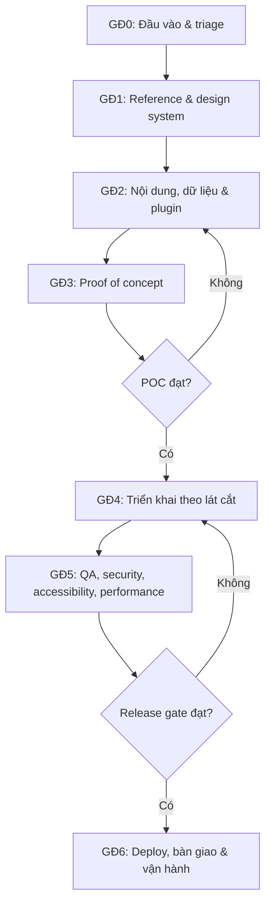
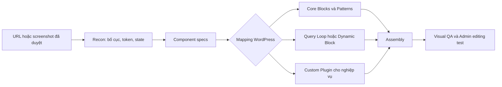

  

# QUY TRÌNH DEV WORDPRESS THỰC CHIẾN AGENCY/FREELANCE — AI-FIRST 2026

## Từ brief đã chốt đến production, tái tạo bố cục tham khảo và bàn giao dễ quản trị

> **Trạng thái:** SOP kỹ thuật dùng cho dự án thực tế
> **Đối tượng:** Developer có kiến thức WordPress cơ bản, freelancer, agency và AI coding agent
> **Phạm vi:** Bắt đầu khi đội dev đã nhận brief, nội dung và phạm vi được phê duyệt
> **Rà soát gần nhất:** 2026-09-10
> **Quy tắc cập nhật:** Thông tin phụ thuộc phiên bản WordPress, PHP, plugin, hosting hoặc gói Free/Pro phải được kiểm tra lại trước mỗi dự án

---

## MỤC LỤC

1. [Phạm vi và cách dùng](#pham-vi-va-cach-dung)
2. [Triết lý AI-First có kiểm soát](#triet-ly-ai-first)
3. [Hợp đồng đầu vào kỹ thuật](#hop-dong-dau-vao)
4. [Quy trình 7 giai đoạn](#quy-trinh-7-giai-doan)
5. [Cổng quyết định và Definition of Done](#cong-quyet-dinh)
6. [Bộ quy tắc cho AI Agent](#quy-tac-ai-agent)
7. [Tái tạo bố cục từ website tham khảo](#tai-tao-bo-cuc)
   - [Repo JCodesMore và cách ứng dụng cho WordPress](#repo-jcodesmore)
8. [Kiến trúc WordPress và mô hình dữ liệu](#kien-truc-wordpress)
   - [Request lifecycle và Hooks](#request-lifecycle-va-hooks)
9. [Chọn plugin, theme và custom code](#chon-plugin-theme-custom-code)
10. [Bảo mật WordPress](#bao-mat-wordpress)
11. [Performance, hình ảnh và Core Web Vitals](#performance-wordpress)
12. [Chiến lược kiểm thử](#chien-luoc-kiem-thu)
13. [Docker, staging và production deployment](#docker-staging-production)

- [Docker Compose local hoàn chỉnh](#docker-compose-local)
- [Lệnh Docker và WP-CLI thường dùng](#docker-wp-cli-thuong-dung)

14. [Backup, monitoring và xử lý sự cố](#backup-monitoring-incident)
15. [Bộ công cụ theo mục đích](#bo-cong-cu)

- [DBeaver thực hành](#dbeaver-thuc-hanh)
- [Postman, k6, Mailpit và tunnel](#tooling-thuc-hanh)

16. [Prompt mẫu cho AI Agent](#prompt-mau)
17. [Checklist bàn giao](#checklist-ban-giao)
18. [Nguồn tham khảo và quản lý phiên bản](#nguon-va-phien-ban)

---

<a id="pham-vi-va-cach-dung"></a>

## 1. PHẠM VI VÀ CÁCH DÙNG

### 1.1. Điểm bắt đầu

Quy trình bắt đầu khi đội dev đã nhận đầu vào từ bộ phận làm việc với khách hàng. Tài liệu **không bao gồm** tìm kiếm khách hàng, báo giá, thương lượng hợp đồng hoặc sản xuất toàn bộ nội dung marketing.

Đội dev vẫn phải kiểm tra chất lượng đầu vào trước khi code. “Đã bàn giao” không đồng nghĩa với “đã đủ để quyết định kiến trúc”. Nếu thiếu thông tin có thể làm thay đổi data model, plugin, theme, license hoặc chi phí vận hành, AI phải báo rõ và dừng tại cổng kỹ thuật tương ứng.

### 1.2. Mục tiêu

- Chuẩn hóa cách biến brief thành hệ thống WordPress có thể vận hành.
- Giao phần lớn công việc phân tích, code, kiểm thử và tài liệu hóa cho AI Agent.
- Giảm thao tác thủ công bằng CLI và automation có kiểm soát.
- Tái tạo bố cục từ website tham khảo mà không sao chép tài sản độc quyền.
- Giữ dữ liệu nghiệp vụ độc lập với giao diện khi dữ liệu cần tồn tại lâu dài.
- Bàn giao để người không biết code vẫn thực hiện được tác vụ thường ngày.
- Có bằng chứng kiểm thử và phương án rollback trước production.

### 1.3. Chọn mức quy trình theo rủi ro

Đây là playbook, không phải một stack bắt buộc. Landing page không cần cùng mức hạ tầng với marketplace, LMS hoặc booking.

| Loại dự án                |     Rủi ro     | Trọng tâm                                             |
| :--------------------------- | :--------------: | :------------------------------------------------------ |
| Website giới thiệu         |      Thấp      | Editor dễ dùng, SEO, tốc độ, form lead             |
| WooCommerce đơn lẻ        |   Trung bình   | Checkout, payment, email, tồn kho, backup              |
| LMS/booking                  | Trung bình–cao | Quyền, lịch, notification, dữ liệu người dùng    |
| Marketplace                  |       Cao       | Vendor, commission, payout, dispute, bảo mật và tải |
| Tích hợp hệ thống ngoài |       Cao       | API contract, webhook, retry, idempotency và logging   |

### 1.4. Đường đọc nhanh cho người dùng lần đầu

Không cần đọc tuần tự toàn bộ tài liệu trước khi bắt đầu:

- **Muốn hiểu quy trình tổng thể:** Đọc phần 1 → 5.
- **Muốn đưa thẳng cho AI:** Đọc phần 3, dùng phần 6 làm `AGENTS.md`, rồi chọn prompt ở phần 16.
- **Muốn tái tạo giao diện tham khảo:** Đọc phần 7, sau đó làm POC theo giai đoạn 3.
- **Muốn viết plugin/CPT/API:** Đọc phần 8 → 10 và phần 12.
- **Muốn dựng môi trường local:** Đi thẳng phần 13 và 15.
- **Muốn deploy/bàn giao:** Đọc phần 5, 13, 14 và 17.

### 1.5. Luồng 10 bước dễ nhớ

```text
1. Nhận brief đã chốt
2. AI kiểm tra codebase và môi trường
3. AI phân tích các URL/screenshot tham khảo
4. Chốt content model, plugin và phần cần custom
5. Dựng một trang hoặc một luồng mẫu hoàn chỉnh
6. Người phụ trách duyệt POC
7. AI nhân rộng theo từng lát cắt
8. AI chạy test và tổng hợp bằng chứng
9. Người phụ trách duyệt production
10. Deploy, smoke test, monitoring và bàn giao
```

### 1.6. Thuật ngữ xuất hiện nhiều

| Thuật ngữ    | Hiểu đơn giản                                                                   |
| :------------- | :---------------------------------------------------------------------------------- |
| Triage         | Kiểm tra nhanh dự án đang có gì và rủi ro nằm ở đâu                     |
| POC            | Bản thử nhỏ chứng minh cách làm thật sự khả thi                            |
| Vertical slice | Hoàn thành một luồng từ dữ liệu/Admin đến frontend và test                |
| Gate           | Điểm cần đạt hoặc cần người có trách nhiệm duyệt trước khi đi tiếp |
| Design token   | Biến dùng chung cho màu, font, khoảng cách, radius, shadow                     |
| ADR            | Ghi lại lý do chọn một quyết định kiến trúc khó thay đổi                |
| Smoke test     | Kiểm tra nhanh các luồng sống còn ngay sau deploy                              |
| Rollback       | Quay lại trạng thái ổn định khi release có lỗi                              |
| RPO/RTO        | Mức dữ liệu chấp nhận mất / thời gian cần để phục hồi                   |

---

<a id="triet-ly-ai-first"></a>

## 2. TRIẾT LÝ AI-FIRST CÓ KIỂM SOÁT

### 2.1. AI làm mặc định, con người duyệt điểm khó đảo ngược

AI được ưu tiên cho công việc có thể kiểm chứng và lặp lại:

- Đọc codebase, tài liệu và log.
- Phân tích website tham khảo bằng browser/devtools khi được phép.
- Lập inventory trang, component, design token và dữ liệu.
- Đề xuất kiến trúc kèm phương án thay thế và rủi ro.
- Viết theme, pattern, block, plugin và test.
- Chạy lint, static analysis, browser test và performance test.
- Tổng hợp thay đổi, kết quả kiểm thử, giới hạn và rollback plan.
- Sinh tài liệu vận hành và hướng dẫn bàn giao.

Con người giữ quyền quyết định tại các điểm có trách nhiệm, chi phí hoặc tác động lớn:

- Chấp nhận kiến trúc và dependency lớn.
- Chấp nhận plugin trả phí, license hoặc vendor lock-in.
- Duyệt proof of concept trước khi nhân rộng.
- Cho phép thay đổi staging/production, DNS, payment và dữ liệu thật.
- Xác nhận luồng nghiệp vụ quan trọng và rủi ro còn lại trước release.

```text
AI thực thi mặc định
    → xuất giả định + bằng chứng + rủi ro
    → con người duyệt cổng quan trọng
    → AI tiếp tục tự động hóa
```

Mục tiêu không phải một tỷ lệ AI cố định. Mục tiêu là để AI xử lý tối đa phần việc có thể đo và kiểm chứng, trong khi con người không trở thành nút thắt cho thao tác kỹ thuật thông thường.

### 2.2. Sáu nguyên tắc bắt buộc

1. **Inspect before edit:** Đọc dự án và nhận diện môi trường trước khi thay đổi.
2. **Evidence before claim:** Không tuyên bố đã xong, nhanh, an toàn hoặc tương thích nếu chưa kiểm tra.
3. **Reversible automation:** Automation phải có phạm vi, log và đường lui.
4. **Environment awareness:** Phân biệt local, staging và production.
5. **Data survives presentation:** Dữ liệu nghiệp vụ không phụ thuộc theme nếu cần tồn tại sau khi đổi giao diện.
6. **Human approval for irreversible impact:** Production, dữ liệu thật, DNS, payment, secrets và thao tác phá hủy cần quyền rõ ràng.

---

<a id="hop-dong-dau-vao"></a>

## 3. HỢP ĐỒNG ĐẦU VÀO KỸ THUẬT

Trước khi code, AI tạo `PROJECT_CONTEXT.md` hoặc tài liệu tương đương.

### 3.1. Đầu vào bắt buộc

- Brief/spec đã được phê duyệt.
- Sitemap và danh sách loại trang.
- Nội dung, logo, hình ảnh hoặc quy tắc dùng placeholder.
- URL tham khảo đại diện cho từng loại layout.
- Danh sách chức năng và luồng nghiệp vụ.
- Ma trận phần khách được sửa, chỉ nhập dữ liệu hoặc phải khóa.
- Responsive target và trình duyệt cần hỗ trợ.
- Yêu cầu SEO, đa ngôn ngữ, accessibility và analytics nếu có.
- Hosting, domain, CDN, email, payment hoặc dịch vụ ngoài liên quan.
- Phiên bản WordPress/PHP nếu là dự án có sẵn.
- Tiêu chí nghiệm thu kỹ thuật.

### 3.2. Khi nào AI phải hỏi lại?

AI chỉ dừng khi thông tin thiếu có thể làm thay đổi đáng kể:

- Data model hoặc quyền truy cập.
- Loại plugin, payment, booking hoặc LMS.
- Kiến trúc theme/block/page builder.
- Chi phí license hoặc dịch vụ trả phí.
- Dữ liệu production hoặc hành động khó rollback.

Với chi tiết trình bày nhỏ, AI được phép dùng giả định hợp lý nhưng phải ghi trong báo cáo.

### 3.3. Artifact chuẩn

| Artifact                    | Nội dung                                                     |
| :-------------------------- | :------------------------------------------------------------ |
| `PROJECT_CONTEXT.md`      | Mục tiêu kỹ thuật, đầu vào, giả định và giới hạn |
| `IMPLEMENTATION_PLAN.md`  | Giai đoạn, vertical slice, dependency và test              |
| `PLUGIN_EVALUATION.md`    | Plugin, Free/Pro, rủi ro và phương án thay thế          |
| `DESIGN_SYSTEM.md`        | Token, typography, spacing, component, responsive             |
| `docs/decisions/ADR-*.md` | Quyết định khó đảo ngược                              |
| `TEST_REPORT.md`          | Kết quả test và bằng chứng                               |
| `RELEASE_RUNBOOK.md`      | Deploy, smoke test và rollback                               |
| `HANDOVER.md`             | Hướng dẫn vận hành theo tác vụ                         |

Website nhỏ có thể gộp file, nhưng nội dung tương ứng không được biến mất.

---

<a id="quy-trinh-7-giai-doan"></a>

## 4. QUY TRÌNH 7 GIAI ĐOẠN TỪ HANDOFF ĐẾN PRODUCTION



### GIAI ĐOẠN 0 — ĐẦU VÀO VÀ TRIAGE

**Mục tiêu:** Hiểu trạng thái thật trước khi chọn giải pháp.

AI thực hiện:

- Xác định full WordPress, custom theme, child theme hay plugin riêng.
- Nhận diện classic theme, block theme hoặc hybrid theme.
- Kiểm tra phiên bản WordPress, PHP, database, WooCommerce và plugin.
- Kiểm tra Git, Docker, WP-CLI, test, lint và coding standards hiện có.
- Ghi nhận thay đổi chưa commit; không ghi đè thay đổi của người khác.
- Đối chiếu brief với codebase và liệt kê gap.
- Phân loại local, staging và production.

**Đầu ra:** Project context, risk list và kế hoạch thực hiện.
**Gate 0:** Không còn thiếu đầu vào có thể làm đổi kiến trúc.

### GIAI ĐOẠN 1 — REFERENCE VÀ DESIGN SYSTEM

**Mục tiêu:** Chuyển website tham khảo thành đặc tả thiết kế, không thành HTML tĩnh khó quản trị.

AI thực hiện:

- Chụp và phân tích desktop, tablet, mobile.
- Lập inventory header, footer, section, component, modal, form và state.
- Trích xuất màu, typography, spacing, radius, shadow, container và breakpoint.
- Ghi hành vi hover, focus, active, sticky, carousel, accordion và menu mobile.
- Phân nhóm template: trang tĩnh, listing/archive, single/detail, search, 404, checkout.
- Mapping phần giữ cấu trúc và phần đổi theo thương hiệu khách hàng.

**Đầu ra:** `DESIGN_SYSTEM.md`, component inventory và screenshot tham chiếu.

### GIAI ĐOẠN 2 — NỘI DUNG, DỮ LIỆU VÀ PLUGIN

**Mục tiêu:** Quyết định nơi dữ liệu sống và cách khách quản trị trước khi làm giao diện hàng loạt.

AI thực hiện:

1. Phân loại Page/Post, CPT, taxonomy, metadata, options, form/lead hoặc bảng riêng.
2. Xác định phần layout thuộc theme và nghiệp vụ thuộc plugin.
3. Lập bảng:

| Nhu cầu                      | WordPress Core | Plugin/theme         | Khoảng trống cần code | Rủi ro |
| :---------------------------- | :------------- | :------------------- | :----------------------- | :------ |
| Ví dụ: danh sách dịch vụ | Query Loop/CPT | Có thể không cần | Field đặc thù         | Thấp   |

4. Xác minh plugin theo tài liệu chính thức và phiên bản hiện tại.
5. Ghi ADR cho theme, builder, plugin lớn, data model hoặc hosting khó đổi.

**Gate 2:** Kiến trúc, plugin và chi phí license được chấp nhận.

### GIAI ĐOẠN 3 — PROOF OF CONCEPT VÀ VERTICAL SLICE

**Mục tiêu:** Chứng minh giải pháp chạy từ Admin đến frontend trước khi nhân rộng.

Chọn một trang hoặc luồng đại diện: trang chủ, listing → detail, form, booking hoặc checkout.

```text
Data model
    → Admin nhập liệu
    → Validation và permission
    → Lưu dữ liệu
    → Render frontend
    → Responsive và accessibility
    → Test
    → Hướng dẫn chỉnh sửa
```

POC đạt khi:

- Giao diện đạt mức tương đồng đã chốt.
- Khách sửa đúng phần được phép mà không cần code.
- Layout quan trọng được khóa/giới hạn phù hợp.
- Dữ liệu động không bị nhập lặp nhiều nơi.
- Desktop, tablet và mobile hoạt động ổn.
- Không có lỗi runtime do custom code trong luồng kiểm tra.
- Có test hoặc bằng chứng kiểm tra tái lập được.
- Kiến trúc có thể nhân rộng mà không copy thủ công quá mức.

**Gate 3:** POC được duyệt trước khi làm toàn bộ.

### GIAI ĐOẠN 4 — TRIỂN KHAI THEO LÁT CẮT

Với mỗi lát cắt:

1. Xác nhận spec và acceptance criteria.
2. Viết/cập nhật test phù hợp.
3. Thực hiện thay đổi nhỏ nhất đủ hoàn thành luồng.
4. Chạy test chức năng, responsive, quyền và runtime.
5. So sánh screenshot nếu UI quan trọng.
6. Cập nhật tài liệu/ADR nếu quyết định đổi.
7. Báo cáo file đã đổi, test, giới hạn, rủi ro và rollback.

Thứ tự gợi ý:

- Foundation: theme, `theme.json`, token, header/footer.
- Content types và field.
- Trang/luồng quan trọng nhất.
- Component dùng chung.
- Template còn lại.
- Integration và automation.
- Admin curation và handover UX.

### GIAI ĐOẠN 5 — QA, SECURITY, ACCESSIBILITY VÀ PERFORMANCE

AI kiểm tra tự động trước; con người kiểm tra trải nghiệm khó đánh giá hoàn toàn bằng máy.

- Functional và regression.
- Responsive và cross-browser theo target.
- Role và permission.
- Form, email, webhook, booking hoặc payment.
- Accessibility: keyboard, focus, contrast, alt, label và error state.
- SEO: title, canonical, robots, sitemap, schema và redirect nếu migration.
- Security: validation, sanitization, escaping, capability, nonce, dependency.
- Performance: payload, query, cache và Core Web Vitals mục tiêu.
- Backup/restore và rollback rehearsal tương xứng rủi ro.

**Gate 5:** Không còn blocker/critical; rủi ro còn lại đã được ghi và chấp nhận.

### GIAI ĐOẠN 6 — DEPLOY, BÀN GIAO VÀ VẬN HÀNH

AI chuẩn bị:

- Pre-deploy checklist.
- Backup và xác minh khả năng truy cập backup.
- Lệnh deploy/migration có thứ tự và phạm vi.
- Smoke test sau deploy.
- Rollback plan.
- Tài liệu quản trị theo tác vụ.
- Báo cáo release và rủi ro còn lại.

Con người thực hiện hoặc phê duyệt:

- DNS, secrets, payment thật và production change.
- Xác nhận form/email/webhook nhận đúng nơi.
- Xác nhận dữ liệu/nội dung production.
- Nghiệm thu và tiếp nhận tài khoản.

---

<a id="cong-quyet-dinh"></a>

## 5. CỔNG QUYẾT ĐỊNH VÀ DEFINITION OF DONE

### 5.1. Cổng quyết định

1. **Plugin gate:** Có nhu cầu, data model và kiểm tra Free/Pro.
2. **Architecture gate:** Có lý do cho lựa chọn khó đảo ngược.
3. **POC gate:** Luồng đại diện chạy trong Admin và frontend.
4. **Scale gate:** Component/pattern được duyệt trước khi nhân rộng.
5. **Release gate:** Test, backup, smoke test và rollback sẵn sàng.
6. **Handover gate:** Đội vận hành làm được tác vụ thường ngày.

### 5.2. Definition of Done cho task

- Acceptance criteria đạt.
- Không còn placeholder/TODO ngoài phạm vi đã ghi.
- Không sửa WordPress core hoặc vendor files.
- Input được validate/sanitize phù hợp; output escape đúng context.
- Capability và nonce được kiểm tra khi cần.
- Test liên quan đã chạy và có kết quả.
- Không phát sinh lỗi runtime mới trong luồng đã kiểm tra.
- Documentation cập nhật nếu hành vi/quyết định đổi.
- Có rollback nếu thay đổi dữ liệu, dependency hoặc production.

### 5.3. Definition of Done cho release

- Backup mới hoàn thành và có thể truy cập.
- Migration có dry run hoặc rehearsal trên staging.
- Staging không index; production index đúng chính sách.
- Form/email/payment/webhook được smoke test.
- Cache được purge đúng lớp.
- SSL, cron, queue, disk, error log và monitoring hoạt động.
- Admin/editor thực hiện được tác vụ chính.
- Không còn blocker/critical.
- Release notes và rollback steps được lưu.

---

<a id="quy-tac-ai-agent"></a>

## 6. BỘ QUY TẮC CHO AI AGENT

Đặt nội dung tương đương trong `AGENTS.md` tại root dự án và điều chỉnh theo codebase.

```markdown
# AGENT RULES FOR WORDPRESS PROJECT

## SCOPE AND CONTEXT
- Read PROJECT_CONTEXT.md, approved specs and relevant ADRs.
- Inspect the repository before changing architecture, dependencies or config.
- Detect WordPress, PHP, database, theme, WooCommerce and plugin versions.
- Distinguish local, staging and production.
- Preserve unrelated and uncommitted user changes.

## AI-FIRST EXECUTION
- Automate repeatable local development, testing and documentation.
- Make reasonable low-risk assumptions and record them.
- Stop only when missing information changes architecture, cost, permissions,
  production data or an irreversible action.
- Report changed files, tests, evidence, remaining risks and rollback steps.

## ARCHITECTURE
- Keep durable business data/rules in a standalone custom plugin.
- Keep presentation, templates, patterns and visual styles in the theme/builder.
- Prefer WordPress Core APIs and official extension points.
- Never modify WordPress core, parent themes or third-party plugin files.
- Record expensive-to-reverse decisions in docs/decisions/.

## BLOCK EDITOR AND HANDOVER
- Prefer Core Blocks when they meet the requirement.
- Use theme.json for global tokens and approved design controls.
- Choose patterns, synced patterns, bindings or dynamic blocks by content model.
- Use block locking/content-only editing where layout must be preserved.
- Do not hardcode customer-editable content into PHP templates.

## PLUGINS AND DEPENDENCIES
- Verify current official docs before claiming Free/Pro or compatibility.
- Record checked version/date, portability and fallback.
- Avoid duplicate plugins owning the same responsibility.
- Do not change production plugins without approval and rollback.
- Prefer WP-CLI for repeatable local/staging operations when supported.

## SECURITY
- Validate early, sanitize when needed and escape late by context.
- Check capabilities; nonces do not replace authentication/authorization.
- Use prepared statements for dynamic SQL.
- Add permission_callback to custom REST routes.
- Never expose secrets, customer data or production dumps.
- Treat uploads, webhooks, redirects, paths and remote URLs as untrusted.

## DATA AND DESTRUCTIVE ACTIONS
- Back up and verify scope before destructive operations.
- Use dry-run when available.
- Do not overwrite production orders, bookings, leads, users or uploads
  without explicit approval.
- Preserve new production data in rollback planning.

## QUALITY
- Implement one vertical slice at a time.
- Run existing tests, lint and static analysis after relevant changes.
- Check PHP logs and browser console for the tested flow.
- Verify responsive behavior and critical interactions in a real browser.
- Test roles, error paths and recovery paths.
- Never report completion when verification did not run; state what remains.

## REFERENCE RECONSTRUCTION
- Extract layout, design tokens and interaction models from approved URLs.
- Do not reuse third-party logos, copy, images, proprietary icons or source code
  unless usage rights are confirmed.
- Build maintainable WordPress components instead of scraped final HTML.

## PRODUCTION
- Production changes require explicit approval.
- Prepare backup, deploy steps, smoke tests, monitoring and rollback first.
- Disable public debug output and keep secrets outside version control.
```

### 6.1. Ma trận quyền hạn AI

| Hành động                                |       AI mặc định       |      Cần người duyệt      |
| :------------------------------------------ | :------------------------: | :---------------------------: |
| Đọc code, log, tài liệu                 |            Có            |            Không            |
| Sửa custom code trong workspace            |            Có            |        Theo scope task        |
| Chạy test/lint/build local                 |            Có            |            Không            |
| Cài plugin local đã có trong kế hoạch |            Có            | Không nếu rollback được |
| Thay dependency/kiến trúc lớn            |         Đề xuất         |              Có              |
| Thao tác staging                           | Chuẩn bị/tự động hóa |      Theo quyền dự án      |
| Deploy production                           |         Chuẩn bị         |              Có              |
| Xóa/ghi đè dữ liệu thật               |           Không           | Có, sau backup và xác minh |
| DNS, payment, secrets                       |     Không tự quyết     |              Có              |

---

<a id="tai-tao-bo-cuc"></a>

## 7. TÁI TẠO BỐ CỤC TỪ WEBSITE THAM KHẢO

### 7.1. Ranh giới

Website tham khảo dùng để học cấu trúc, nhịp thị giác, design tokens và interaction. Kết quả phải:

- Phù hợp thương hiệu/nội dung khách hàng.
- Dùng component WordPress có thể bảo trì.
- Không nhúng HTML scrape làm implementation cuối.
- Không dùng tài sản chưa có quyền.
- Có trải nghiệm chỉnh sửa phù hợp.

AI chỉ trích xuất bố cục, tỷ lệ, khoảng cách, màu tham khảo và mô hình tương tác. Không sử dụng lại logo, copy, ảnh, icon độc quyền hoặc mã nguồn nếu quyền sử dụng chưa được xác nhận.

### 7.2. Cụm URL đại diện

Cung cấp ít nhất một URL cho mỗi template archetype:

- Trang chủ/landing page.
- Trang tĩnh đặc biệt.
- Listing/archive/search.
- Single/detail.
- Blog archive/single nếu khác hệ thống chính.
- Cart/checkout/account nếu thuộc scope.
- Modal, menu mobile, filter hoặc form đặc biệt.

AI có thể khám phá menu, internal links hoặc sitemap nếu công cụ và quyền cho phép, nhưng không mặc định mọi trang đều crawl được. Với login, anti-bot, render động hoặc thiếu sitemap, AI phải báo giới hạn quan sát.

### 7.3. Pipeline

```text
URL/screenshot được duyệt
    → capture nhiều viewport
    → inventory component/state
    → design tokens
    → mapping Core Block/Pattern/Dynamic Block
    → POC
    → visual comparison
    → admin editing test
```

### 7.4. Chọn loại block

| Tình huống                            | Giải pháp ưu tiên                                           |
| :-------------------------------------- | :-------------------------------------------------------------- |
| Section tĩnh, sửa riêng từng trang  | Core Blocks + Pattern                                           |
| CTA dùng chung toàn site              | Synced Pattern                                                  |
| Layout chung, nội dung mỗi nơi khác | Synced Pattern Overrides/Bindings nếu phù hợp                |
| Danh sách CPT/taxonomy                 | Query Loop hoặc dynamic block                                  |
| UI nghiệp vụ có state phức tạp     | Custom/dynamic block hoặc plugin chuyên dụng                 |
| Khách chỉ sửa chữ/ảnh              | `templateLock: "contentOnly"` hoặc curation tương đương |

### 7.5. Tiêu chí visual

Không dùng “giống 100%”. Chốt tiêu chí:

- Cấu trúc section và thứ tự nội dung đúng spec.
- Typography, màu, spacing dùng token đã duyệt.
- Sai lệch screenshot trong mức dự án chấp nhận.
- Không overflow/vỡ layout ở viewport mục tiêu.
- Hover, focus, menu mobile và interaction chính hoạt động.
- Nội dung thật không làm hỏng component.
- Admin sửa đúng phạm vi và không bị quá nhiều controls.

<a id="repo-jcodesmore"></a>

### 7.6. Repo `ai-website-cloner-template` và cách ứng dụng cho WordPress

Repo [JCodesMore/ai-website-cloner-template](https://github.com/JCodesMore/ai-website-cloner-template) là một bộ khung AI-first hữu ích để phân tích và dựng lại **giao diện** từ URL tham khảo. Repo hiện hướng dẫn tạo dự án qua **Use this template**, hỗ trợ nhiều coding agent và cung cấp lệnh `/clone-website <urls>`.

Skill không bị thay bằng một prompt ngắn: bản repo hiện tại có skill riêng cho Codex tại `.codex/skills/clone-website/SKILL.md` và các bản tương ứng cho nhiều agent khác. Nên giữ **toàn bộ repo template** vì skill còn làm việc với `AGENTS.md`, scripts, thư mục research và cấu trúc dự án; không chỉ copy riêng một file `SKILL.md` rồi mong mọi bước hoạt động giống nhau.

Điểm cần hiểu rõ: đầu ra gốc của repo là ứng dụng Next.js/React, **không phải theme WordPress**. Vì vậy, trong dự án WordPress ta học và tái sử dụng **quy trình quan sát → đặc tả → dựng component → so sánh**, không bê nguyên mã Next.js vào theme.

| Pipeline của repo | Cách chuyển sang WordPress                                                                       |
| :----------------- | :------------------------------------------------------------------------------------------------- |
| Reconnaissance     | Chụp các viewport, ghi component/state, font, màu, spacing và interaction                      |
| Foundation         | Chuyển token đã duyệt vào`theme.json`, global styles và asset pipeline                     |
| Component Specs    | Mô tả từng section rồi mapping sang Core Block, Pattern, Query Loop hoặc custom block         |
| Parallel Build     | Chia theo section/vertical slice có ranh giới file rõ; tránh nhiều agent sửa cùng một file |
| Assembly & QA      | Ghép template, visual comparison, responsive test và Admin editing test                          |



**Cách dùng thực tế:**

1. Trên GitHub, bấm **Use this template → Create a new repository**. Không làm website trực tiếp trong repo gốc.
2. Clone **repo mới của mình**, cài phiên bản Node.js theo phần Prerequisites hiện tại của repo rồi chạy `npm install`.
3. Mở repo mới bằng Codex/agent được hỗ trợ và chạy `/clone-website <url-1> <url-2>`. Nếu client không dùng slash command, yêu cầu tự nhiên: `Clone <url> using the clone-website workflow`.
4. Cung cấp cụm URL đại diện ở mục 7.2, không chỉ một trang chủ.
5. Yêu cầu AI xuất component inventory, design tokens, responsive rules và interaction states trước khi code.
6. Duyệt kết quả phân tích; loại bỏ logo, nội dung, hình ảnh, icon hoặc tài sản không có quyền sử dụng.
7. Yêu cầu AI tạo **WordPress mapping spec**, không yêu cầu copy source hoặc chuyển JSX máy móc sang PHP.
8. Triển khai một vertical slice trong codebase WordPress rồi kiểm tra cả frontend lẫn trải nghiệm biên tập.

```bash
# URL này phải là repo mới được tạo từ nút Use this template
git clone https://github.com/YOUR-USERNAME/YOUR-WEBSITE-REPOSITORY.git
cd YOUR-WEBSITE-REPOSITORY
npm install

# Sau đó mở AI coding agent và chạy:
# /clone-website https://example-reference.com
```

Sau reconnaissance, giữ `docs/research/` và screenshot/spec làm bằng chứng thiết kế. Phần Next.js sinh ra có thể dùng làm prototype/đối chiếu visual; implementation giao khách vẫn phải được chuyển thành kiến trúc WordPress đã chốt ở phần 8.

Prompt chuyển tiếp đề xuất:

> Dùng các URL/screenshot được duyệt chỉ làm visual reference. Hãy thực hiện reconnaissance và xuất: template archetypes, component inventory, design tokens, responsive behavior, interaction states và phần không quan sát được. Sau đó mapping từng component sang Core Block, Pattern, Synced Pattern, Query Loop, Dynamic Block hoặc custom plugin. Mục tiêu là triển khai WordPress dễ bảo trì và dễ chỉnh sửa; không sao chép logo, copy, ảnh, proprietary assets hoặc source code. Chưa code cho đến khi mapping spec được duyệt.

Repo này là **công cụ tăng tốc**, không thay thế kiến trúc WordPress, content model, security review, accessibility, performance test hoặc quyền sử dụng tài sản. Nếu điều khoản website nguồn không cho phép truy cập tự động, hãy dùng screenshot/tài liệu do phía dự án cung cấp thay vì crawl.

---

<a id="kien-truc-wordpress"></a>

## 8. KIẾN TRÚC WORDPRESS VÀ MÔ HÌNH DỮ LIỆU

### 8.1. Ranh giới code

```text
wordpress-root/
├── wp-admin/                 # WordPress Core — không sửa
├── wp-includes/              # WordPress Core — không sửa
├── wp-config.php             # Cấu hình; không commit secrets
└── wp-content/
    ├── plugins/
    │   └── client-core/      # Nghiệp vụ, CPT, API, integration
    ├── themes/
    │   └── client-theme/     # Template, pattern, theme.json, assets
    └── uploads/              # Runtime data; không quản lý như source code
```

Không sửa parent theme/plugin bên thứ ba. Extension đi qua child theme, custom plugin, hook, template override được hỗ trợ hoặc API chính thức.

### 8.2. Theme và plugin

**Theme:** layout, template, pattern, branding, `theme.json`, global styles, header/footer.
**Custom plugin:** CPT, taxonomy, nghiệp vụ, REST, webhook, cron, form processing, workflow, permission, dynamic block.

Đổi theme có thể giữ dữ liệu nếu dữ liệu nằm đúng lớp, nhưng template, shortcode, block và cách hiển thị vẫn có thể cần migration. Không cam kết đổi theme không ảnh hưởng 100%.

### 8.3. Chọn nơi lưu dữ liệu

| Dữ liệu              | Nơi phù hợp                                | Ví dụ                                  |
| :--------------------- | :-------------------------------------------- | :--------------------------------------- |
| Biên tập tự do      | Post/Page block content                       | Landing page, blog                       |
| Có cấu trúc         | CPT + taxonomy + metadata                     | Dịch vụ, dự án, giảng viên         |
| Cấu hình dùng chung | Options/Settings API                          | Hotline, địa chỉ, toggle              |
| Giao dịch             | Plugin CRUD/data store hoặc bảng thiết kế | Order, booking, ledger                   |
| Quan hệ/tải lớn     | Bảng riêng khi có bằng chứng             | Event log, queue, nghiệp vụ đặc thù |

WordPress không phải một ORM thống nhất. Hệ sinh thái có `WP_Query`, metadata, Options, taxonomy, REST và một số CRUD objects/data stores như WooCommerce.

Ưu tiên API cấp cao khi phù hợp. Khi cần SQL động qua `$wpdb`, dùng `$wpdb->prepare()`, allowlist cho identifier và đánh giá cache/index.

### 8.4. ADR

Tạo ADR khi chọn theme/builder, plugin nghiệp vụ lớn, data model, authentication, payment, hosting, cache hoặc deployment model.

```markdown
# ADR-001: Tên quyết định

## Status
Proposed | Accepted | Superseded | Deprecated

## Date
YYYY-MM-DD

## Context
Bối cảnh, yêu cầu và giới hạn.

## Decision
Quyết định và lý do.

## Alternatives considered
Lựa chọn khác, ưu/nhược và lý do không chọn.

## Consequences
Chi phí, lock-in, migration, vận hành và rủi ro.
```

<a id="request-lifecycle-va-hooks"></a>

### 8.5. Request lifecycle — hiểu luồng trước khi debug

Khi người dùng mở một URL WordPress, luồng được giản lược như sau:

```text
Browser gửi HTTP request
    → Web server/reverse proxy
    → index.php và wp-blog-header.php
    → wp-load.php đọc wp-config.php
    → wp-settings.php nạp Core, mu-plugin, plugin và theme
    → Rewrite xác định loại request
    → WP_Query lấy dữ liệu
    → Template hierarchy/block template chọn giao diện
    → Hooks, blocks và template render HTML
    → HTTP response trả về browser
```

Sơ đồ này giúp khoanh vùng lỗi:

- Lỗi 502/504 trước PHP thường nằm ở proxy, PHP-FPM hoặc tài nguyên máy chủ.
- Lỗi kết nối database xảy ra trước khi theme render.
- URL 404 sai có thể liên quan rewrite/permalink hoặc query.
- Dữ liệu đúng nhưng giao diện sai thường nằm ở template, block render, CSS hoặc cache.
- Chỉ lỗi sau khi bật plugin thường cần xem hook, dependency, migration và compatibility của plugin đó.

### 8.6. Actions và Filters

Hook giúp mở rộng WordPress mà không sửa Core hoặc vendor:

- **Action:** chạy thêm một hành động tại một thời điểm. Callback thường không cần trả lại giá trị.
- **Filter:** nhận một giá trị, biến đổi và **phải trả lại** giá trị đó.

```php
<?php
/** Đăng ký một CPT khi WordPress khởi tạo. */
function client_core_register_project_post_type(): void {
    register_post_type(
        'client_project',
        array(
            'label'       => __( 'Projects', 'client-core' ),
            'public'      => true,
            'show_in_rest' => true,
        )
    );
}
add_action( 'init', 'client_core_register_project_post_type' );

/** Thêm class có kiểm soát vào thẻ body. */
function client_theme_body_classes( array $classes ): array {
    $classes[] = 'client-site';
    return $classes;
}
add_filter( 'body_class', 'client_theme_body_classes' );
```

Nguyên tắc: prefix tên hàm/class/option; xác nhận priority và số arguments; không chạy truy vấn nặng trên hook gọi nhiều; escape lúc output; kiểm tra capability và nonce cho thao tác thay đổi dữ liệu.

### 8.7. Bản đồ database WordPress

Tên bảng thực tế dùng prefix trong `$table_prefix`; không mặc định luôn là `wp_`.

| Nhóm bảng                                                                | Dữ liệu thường gặp                           | Lưu ý khi debug                                                                           |
| :------------------------------------------------------------------------- | :------------------------------------------------ | :------------------------------------------------------------------------------------------ |
| `*_posts`, `*_postmeta`                                                | Post, Page, attachment, CPT và metadata          | Một object có thể tạo nhiều dòng meta; tránh query meta thiếu index ở quy mô lớn |
| `*_terms`, `*_term_taxonomy`, `*_term_relationships`, `*_termmeta` | Category, tag, taxonomy và quan hệ              | Phân biệt term với taxonomy context                                                      |
| `*_users`, `*_usermeta`                                                | Tài khoản, role/capability và metadata         | Không đọc/sửa password trực tiếp; dùng WordPress API                                 |
| `*_comments`, `*_commentmeta`                                          | Comment/review và metadata                       | Plugin có thể dùng cho review hoặc workflow khác                                       |
| `*_options`                                                              | Cấu hình site, transient và dữ liệu autoload | Option autoload lớn có thể ảnh hưởng mọi request                                     |
| WooCommerce HPOS nếu bật                                                 | Order, address, operational data                  | Dùng WooCommerce CRUD/data store, không giả định order luôn ở`posts`               |
| Bảng custom plugin                                                        | Booking, queue, log hoặc nghiệp vụ đặc thù  | Phải có schema version, migration, index và uninstall policy                             |

DBeaver phù hợp để quan sát dữ liệu và xác minh giả thuyết. Ưu tiên tài khoản chỉ đọc; không sửa/xóa trực tiếp production nếu thao tác có thể thực hiện bằng WordPress/WooCommerce API hoặc migration đã kiểm thử.

---

<a id="chon-plugin-theme-custom-code"></a>

## 9. CHỌN PLUGIN, THEME VÀ PHẠM VI CUSTOM CODE

### 9.1. Tiêu chí plugin

- Bản Free có hoàn thành trọn luồng chính không.
- Phiên bản WordPress/PHP/WooCommerce được hỗ trợ.
- Tần suất cập nhật, changelog và security history.
- Khả năng export/migrate dữ liệu.
- Trải nghiệm quản trị theo role thực tế.
- Ảnh hưởng assets, database, cron và cache.
- Telemetry, dữ liệu bên thứ ba và privacy.
- License, renewal, support và chi phí scale.
- Khả năng thay thế nếu plugin ngừng phát triển.

Không cài hai plugin sở hữu cùng trách nhiệm nếu không có lý do và test tương thích.

### 9.2. Mẫu đánh giá

| Plugin      | Version/date checked | Core flow ở Free | Giới hạn Free | Khi cần Pro       | Portability | Rủi ro      |
| :---------- | :------------------- | :---------------- | :-------------- | :----------------- | :---------- | :----------- |
| Tên plugin | x.y / YYYY-MM-DD     | Luồng đã test  | Thiếu gì      | Trigger nâng cấp | Export/API  | Low/Med/High |

### 9.3. Ứng viên tham khảo, không phải mặc định

> Kiểm tra tài liệu chính thức trước mỗi dự án. Gói Free/Pro có thể đổi sau ngày rà soát.

- **E-commerce:** WooCommerce làm nền; checkout/funnel, swatches, subscription chỉ thêm khi spec cần.
- **Marketplace:** Dokan Lite, WCFM Marketplace, MultiVendorX là ứng viên POC. Test vendor dashboard, commission, payout, refund, shipping và export đúng gói.
- **LMS:** Masteriyo, Tutor LMS, LearnPress là ứng viên. Xác minh payment, certificate, quiz, instructor, drip và reporting.
- **Hotel booking:** MotoPress Hotel Booking Lite có thể POC availability/booking cơ bản; tại 2026-09-10, OTA iCal được liệt kê là Pro.
- **Appointment/event:** Amelia Lite phù hợp thử booking cơ bản; tại 2026-09-10, Google Calendar nằm trong nhóm Premium.

### 9.4. Khi nào custom code?

- Nghiệp vụ riêng hoặc không có plugin phù hợp.
- Plugin ép sai quy trình, lock-in lớn hoặc không sở hữu dữ liệu cần thiết.
- Tính năng nhỏ, rõ và test được tốt hơn việc cài plugin lớn.
- Cần adapter giữa plugin/hệ thống mà không sửa vendor code.

Không tự xây page builder, SEO/cache engine, payment gateway hoặc form builder tổng quát nếu giải pháp ổn định đã đáp ứng và rủi ro tự xây cao hơn.

---

<a id="bao-mat-wordpress"></a>

## 10. BẢO MẬT WORDPRESS

Bảo mật là nhiều lớp. Không có checklist “chống hack 99,9%” và không plugin/setting đơn lẻ nào thay update, phân quyền, backup và monitoring.

### 10.1. Baseline

- Update Core/theme/plugin qua staging → test → production.
- Mật khẩu mạnh, MFA và không dùng chung admin.
- Least privilege cho mọi role.
- HTTPS; rate limiting/WAF khi phù hợp.
- `DISALLOW_FILE_EDIT` giảm bề mặt tấn công nhưng không bảo vệ hoàn chỉnh.
- Không dùng theme/plugin nulled hoặc nguồn không xác minh.
- Secrets ngoài Git và không xuất trong log AI.
- Production không hiển thị debug error công khai.
- Backup off-site, logging và alert hoạt động trước launch.

### 10.2. Secure coding

1. Validate input và ưu tiên allowlist.
2. Sanitize khi cần chuẩn hóa trước khi lưu.
3. Escape output theo context: `esc_html()`, `esc_attr()`, `esc_url()`, `wp_kses()`.
4. Check capability trước hành động nhạy cảm.
5. Nonce chống CSRF nhưng không thay authentication/authorization.
6. Dùng `$wpdb->prepare()` cho SQL động.
7. REST route có `permission_callback`, schema và validation phù hợp.
8. Upload kiểm tra quyền, MIME/type, size, tên file và nơi lưu.
9. Webhook xác minh signature/secret, xử lý replay/idempotency khi cần.
10. Remote request kiểm soát URL, timeout, redirect và lỗi để giảm SSRF.

### 10.3. Biện pháp tùy điều kiện

- Đổi URL login chỉ giảm bot rác; không thay MFA/rate limit.
- Chỉ tắt XML-RPC sau khi xác minh không có integration phụ thuộc.
- Đổi database prefix là hardening nhẹ, không chống SQL injection.
- Chặn script trong uploads phải đúng web server và được test; `.htaccess` không áp dụng cho Nginx.
- Chỉ cho upload SVG khi có sanitizer và role phù hợp.

AI không được kết luận site “an toàn” chỉ vì không thấy warning trong log hoặc đã quét source.

---

<a id="performance-wordpress"></a>

## 11. PERFORMANCE, HÌNH ẢNH VÀ CORE WEB VITALS

### 11.1. Mục tiêu đo được

Không cam kết chung “load dưới 1 giây” hoặc “PageSpeed 100”. Ghi rõ trang, mobile/desktop, device/network, lab/field, dataset, cache và hosting/CDN.

Core Web Vitals “Good” tham khảo:

- LCP ≤ 2,5 giây.
- INP ≤ 200 ms.
- CLS ≤ 0,1.
- Đánh giá field data ở phân vị 75 khi đủ dữ liệu.

Lighthouse là tín hiệu lab để debug, không phải cam kết duy nhất.

### 11.2. Hình ảnh và font

- Chọn AVIF/WebP/JPEG/PNG theo nội dung, chất lượng và môi trường.
- SVG chỉ dùng từ nguồn tin cậy và đã sanitize.
- Giữ `srcset`/`sizes`, có `width`/`height` hoặc aspect ratio.
- Lazy-load ảnh ngoài viewport; tránh lazy-load hero/LCP.
- Preload/fetch priority có chọn lọc khi có bằng chứng.
- Dùng performance budget theo loại trang, không áp một mức KB cho mọi ảnh.
- Chọn font theo thương hiệu và tiếng Việt; giảm family/weight/style.
- Self-host nếu phù hợp privacy/performance; dùng `font-display` và preload có chọn lọc.

### 11.3. Cache và database

- Page cache cho trang có thể cache; loại trừ cart/checkout/account/cá nhân hóa.
- Persistent object cache chỉ bật khi workload hưởng lợi, sau đó đo.
- Bật OPcache phù hợp trên production PHP.
- Dọn revisions/transients theo retention và backup; không xóa hàng loạt thiếu phạm vi.
- Tối ưu query dựa trên Query Monitor/APM/slow log, không đoán.
- Chỉ thêm index sau khi phân tích query plan và tác động ghi.

### 11.4. Asset cleanup

Trước `wp_dequeue_*`:

1. Xác định handle và dependency thật.
2. Kiểm tra mọi trang có component liên quan.
3. Test logged-in/out, cache on/off và mobile.
4. Kiểm tra browser console và form submission.
5. Ghi lý do để người sau hiểu vì sao asset bị chặn.

---

<a id="chien-luoc-kiem-thu"></a>

## 12. CHIẾN LƯỢC KIỂM THỬ

### 12.1. Lớp test

| Lớp               | Khi dùng                   | Ví dụ                        |
| :----------------- | :-------------------------- | :----------------------------- |
| PHP syntax/lint    | Mọi custom PHP             | `php -l`, PHPCS              |
| Static analysis    | Plugin có logic đáng kể | PHPStan/Psalm                  |
| Unit               | Quy tắc độc lập         | Giá, trạng thái, mapping    |
| Integration        | Hook, REST, database        | CPT, capability, webhook       |
| Browser/E2E        | Luồng người dùng        | Form, booking, checkout, Admin |
| Visual regression  | UI quan trọng              | Screenshot desktop/mobile      |
| Load               | Có yêu cầu tải          | Search, listing, checkout API  |
| Manual exploratory | UX/edge case                | Keyboard, menu, content dài   |

Mức test tương xứng với rủi ro; website nhỏ không buộc dùng mọi lớp.

### 12.2. Ma trận tối thiểu

- Guest, logged-in và từng role liên quan.
- Desktop, tablet, mobile nhỏ/lớn.
- Nội dung ngắn, dài, thiếu ảnh và tiếng Việt.
- Happy path, validation error, timeout và dịch vụ ngoài lỗi.
- Cache lạnh/nóng nếu performance quan trọng.
- Spam, duplicate form và email failure.
- Payment/webhook duplicate nếu có giao dịch.
- Admin edit, preview, undo và publish.
- Browser console, PHP log và network request.

### 12.3. Accessibility baseline

Mục tiêu mặc định cho dự án mới là WCAG 2.2 AA nếu hợp đồng không quy định khác:

- Dùng bàn phím, không keyboard trap.
- Focus thấy rõ và đúng thứ tự.
- Contrast đủ.
- Heading/landmark có cấu trúc.
- Alt text đúng; ảnh trang trí alt rỗng.
- Form có label, hướng dẫn và lỗi rõ.
- Không chỉ dùng màu để truyền thông tin.
- Nút/link có accessible name và vùng bấm phù hợp.
- Animation tôn trọng `prefers-reduced-motion` khi phù hợp.

### 12.4. Load test

- Chạy trên staging/môi trường được phép, không tự stress production.
- Mô tả workload, ramp-up, concurrency và thời gian.
- Ghi p50/p95/p99 latency, throughput, error rate và resource usage.
- Không kết luận cần Redis/tăng PHP-FPM chỉ từ triệu chứng; đối chiếu CPU, RAM, DB, cache, network và log.

---

<a id="docker-staging-production"></a>

## 13. DOCKER, STAGING VÀ PRODUCTION DEPLOYMENT

### 13.1. Local Docker

Docker local giúp đồng nhất PHP/database và tự động setup; không giả định production cũng phải dùng Docker. Port database/Mailpit chỉ mở theo nhu cầu, bind phù hợp và không dùng password production.

```bash
docker compose exec -T wordpress wp plugin list --allow-root
docker compose exec -T wordpress wp option get siteurl --allow-root
```

`wordpress` chỉ là ví dụ. AI phải đọc file Compose thay vì giả định service tên `store_app`.

### 13.2. Production baseline

- Không public database port ra Internet.
- Secrets ngoài Git, trong secret manager/environment phù hợp.
- Tắt `WP_DEBUG_DISPLAY`; log nội bộ có retention và access control.
- Có TLS và reverse proxy/load balancer theo hạ tầng.
- Persistent data được backup.
- Healthcheck, restart và resource limit được thiết kế; restart không thay điều tra crash loop.
- Cron/Action Scheduler chạy đúng.
- Email production có provider và SPF/DKIM/DMARC theo nhu cầu.

### 13.3. Git chứa gì?

Git thường chứa custom theme/plugin, mu-plugin của dự án, config template không có secret, migration, test, tài liệu và deploy script.

Git không thay backup database/uploads và không chứa production dump/secret.

### 13.4. Release runbook

**Trước deploy:**

1. Xác nhận release scope và maintenance window.
2. Chạy test/lint/build.
3. Backup database + files thành cùng backup set.
4. Kiểm tra disk và khả năng truy cập backup.
5. Rehearsal migration trên staging.
6. Chuẩn bị rollback bảo toàn dữ liệu mới.

**Deploy:**

1. Maintenance mode nếu cần consistency.
2. Deploy version cố định.
3. Chạy migration có log.
4. Search-replace URL bằng WP-CLI với `--dry-run` trước.
5. Purge đúng lớp cache.
6. Tắt maintenance mode.

```bash
wp search-replace 'http://old.local' 'https://example.com' --all-tables-with-prefix --precise --dry-run
```

Chỉ bỏ `--dry-run` sau khi xác nhận phạm vi và backup.

**Sau deploy:**

- Homepage, trang quan trọng, login và Admin.
- Form/email/webhook/payment/booking tùy dự án.
- Canonical, robots, sitemap, HTTPS redirect.
- Cron/queue, cache, error log và monitoring.
- Đối chiếu bản ghi quan trọng nếu migration.

### 13.5. Rollback

Rollback code và dữ liệu là hai việc khác nhau. Restore database cũ trên shop/booking có thể làm mất order, booking hoặc lead mới.

Runbook phải ghi:

- Khi nào rollback code-only.
- Khi nào restore database hoặc forward fix.
- Cách bảo toàn dữ liệu mới.
- Người có quyền quyết định.
- Cách kiểm chứng sau rollback.

<a id="docker-compose-local"></a>

### 13.6. Docker Compose local hoàn chỉnh

Mẫu dưới đây tạo WordPress, MariaDB, WP-CLI và Mailpit cho **local development**. Tên image/tag chỉ là baseline; khi áp dụng vào dự án phải chọn tag tương thích rồi pin version hoặc digest đã kiểm thử, không dùng tag `latest` cho release có kiểm soát.

```yaml
# compose.yaml
services:
  database:
    image: mariadb:11.4
    restart: unless-stopped
    environment:
      MARIADB_DATABASE: ${DB_NAME}
      MARIADB_USER: ${DB_USER}
      MARIADB_PASSWORD: ${DB_PASSWORD}
      MARIADB_ROOT_PASSWORD: ${DB_ROOT_PASSWORD}
    ports:
      - "127.0.0.1:${DB_HOST_PORT:-3307}:3306"
    volumes:
      - db_data:/var/lib/mysql
    healthcheck:
      test: ["CMD-SHELL", "mariadb-admin ping -h localhost -u root -p$${MARIADB_ROOT_PASSWORD} --silent"]
      interval: 5s
      timeout: 5s
      retries: 20

  wordpress:
    image: ${WORDPRESS_IMAGE:-wordpress:php8.3-apache}
    restart: unless-stopped
    depends_on:
      database:
        condition: service_healthy
    environment:
      WORDPRESS_DB_HOST: database:3306
      WORDPRESS_DB_NAME: ${DB_NAME}
      WORDPRESS_DB_USER: ${DB_USER}
      WORDPRESS_DB_PASSWORD: ${DB_PASSWORD}
      WORDPRESS_TABLE_PREFIX: ${WP_TABLE_PREFIX:-wp_}
      WORDPRESS_DEBUG: ${WP_DEBUG:-1}
    ports:
      - "127.0.0.1:${WP_HOST_PORT:-8888}:80"
    volumes:
      - wp_data:/var/www/html
      - ./wp-content/plugins/client-core:/var/www/html/wp-content/plugins/client-core
      - ./wp-content/themes/client-theme:/var/www/html/wp-content/themes/client-theme

  wpcli:
    image: ${WPCLI_IMAGE:-wordpress:cli-php8.3}
    profiles: ["tools"]
    user: "33:33"
    depends_on:
      database:
        condition: service_healthy
      wordpress:
        condition: service_started
    environment:
      WORDPRESS_DB_HOST: database:3306
      WORDPRESS_DB_NAME: ${DB_NAME}
      WORDPRESS_DB_USER: ${DB_USER}
      WORDPRESS_DB_PASSWORD: ${DB_PASSWORD}
      WORDPRESS_TABLE_PREFIX: ${WP_TABLE_PREFIX:-wp_}
    volumes:
      - wp_data:/var/www/html
      - ./wp-content/plugins/client-core:/var/www/html/wp-content/plugins/client-core
      - ./wp-content/themes/client-theme:/var/www/html/wp-content/themes/client-theme
    working_dir: /var/www/html
    entrypoint: ["wp", "--allow-root"]

  mailpit:
    image: axllent/mailpit:v1
    restart: unless-stopped
    ports:
      - "127.0.0.1:${MAILPIT_UI_PORT:-8025}:8025"

volumes:
  db_data:
  wp_data:
```

Nếu tên theme/plugin khác, sửa bind mount cho đúng codebase. Nếu dự án quản lý toàn bộ `wp-content`, có thể đổi chiến lược mount nhưng phải tránh che mất file đã có trong named volume.

Tạo `.env.example` để mô tả cấu hình và thêm `.env` thật vào `.gitignore`:

```dotenv
# .env.example — chỉ là credential local, không dùng lại ở staging/production
DB_NAME=wordpress_local
DB_USER=wordpress_local
DB_PASSWORD=change-this-local-password
DB_ROOT_PASSWORD=change-this-local-root-password
DB_HOST_PORT=3307

WP_HOST_PORT=8888
WP_TABLE_PREFIX=wp_
WP_DEBUG=1
WORDPRESS_IMAGE=wordpress:php8.3-apache
WPCLI_IMAGE=wordpress:cli-php8.3

MAILPIT_UI_PORT=8025
```

`WORDPRESS_DEBUG` trong image chỉ hỗ trợ bật debug cơ bản. Nếu cần kiểm soát `WP_DEBUG_LOG`, `WP_DEBUG_DISPLAY`, memory limit hoặc SMTP local, dùng config project đã review; không chèn bí mật trực tiếp vào source.

### 13.7. Chạy lần đầu và chẩn đoán

```bash
# 1. Kiểm tra Compose sau khi biến môi trường được thay thế
docker compose config

# 2. Khởi động và xem trạng thái
docker compose up -d
docker compose ps

# 3. Xem log khi WordPress không lên
docker compose logs --tail=200 wordpress
docker compose logs --tail=200 database

# 4. Kiểm tra WP-CLI nhìn thấy site
docker compose run --rm wpcli core version
docker compose run --rm wpcli option get siteurl
```

Mở `http://localhost:8888` hoặc port trong `.env`; Mailpit ở `http://localhost:8025`. Service Mailpit **không tự chuyển email WordPress**: cấu hình SMTP plugin/adapter local với host `mailpit`, port `1025`, không TLS và không auth. Cấu hình này chỉ dùng local; production phải dùng email provider thật.

Nếu container lỗi:

1. Chạy `docker compose ps` để xem health/status.
2. Đọc log đúng service; không xóa volume ngay khi chưa biết có dữ liệu cần giữ.
3. Chạy `docker compose config` để phát hiện biến thiếu hoặc YAML sai.
4. Kiểm tra port host có bị ứng dụng khác chiếm.
5. Kiểm tra bind mount và quyền file trước khi sửa permission diện rộng.

<a id="docker-wp-cli-thuong-dung"></a>

### 13.8. Docker và WP-CLI thường dùng

```bash
# Trạng thái và phiên bản
docker compose ps
docker compose run --rm wpcli core version
docker compose run --rm wpcli plugin list
docker compose run --rm wpcli theme list

# Kiểm tra cấu hình — các lệnh đọc
docker compose run --rm wpcli option get home
docker compose run --rm wpcli option get siteurl
docker compose run --rm wpcli rewrite list

# Kiểm tra search-replace; chưa thay dữ liệu
docker compose run --rm wpcli search-replace \
  'http://old.local' 'http://localhost:8888' \
  --all-tables-with-prefix --precise --dry-run

# Xuất database local vào volume WordPress
docker compose run --rm wpcli db export \
  /var/www/html/wp-content/uploads/local-backup.sql --add-drop-table
```

Phân loại lệnh trước khi giao AI chạy:

| Nhóm                  | Ví dụ                                                      | Quy tắc                                                |
| :--------------------- | :----------------------------------------------------------- | :------------------------------------------------------ |
| Đọc                  | `plugin list`, `option get`, `db size`                 | AI có thể chạy sau khi xác nhận đúng environment |
| Có thể đảo ngược | activate/deactivate plugin, flush cache                      | Ghi trạng thái trước và có cách hoàn tác       |
| Thay đổi dữ liệu   | search-replace không`--dry-run`, import DB, update option | Backup + duyệt phạm vi + kiểm tra sau lệnh          |
| Phá hủy              | xóa volume,`db reset`, delete hàng loạt                 | Con người phê duyệt rõ target; không suy đoán   |

`docker compose down` dừng và xóa container/network nhưng giữ named volume. Tùy chọn `--volumes` sẽ xóa dữ liệu local của các volume trong Compose, vì vậy không dùng như một bước “sửa lỗi nhanh” khi chưa backup và xác nhận target.

### 13.9. Local khác production ở đâu?

| Hạng mục    | Local Docker                                              | Staging/Production                                                               |
| :------------ | :-------------------------------------------------------- | :------------------------------------------------------------------------------- |
| Truy cập     | Bind web/DB/Mail UI vào`127.0.0.1`                     | Web qua TLS; database ở private network, không public port                     |
| Debug         | Có thể bật log chi tiết, không chứa dữ liệu thật | Không hiển thị lỗi cho người dùng; log có quyền truy cập và retention |
| Secrets       | Credential local riêng, có thể tái tạo               | Secret manager/environment của hạ tầng; rotate và audit                      |
| Email         | Mailpit, không gửi ra ngoài                            | Provider thật, SPF/DKIM/DMARC theo domain                                       |
| Dữ liệu     | Dữ liệu giả hoặc đã ẩn danh                        | Dữ liệu thật, privacy và retention rõ ràng                                 |
| Persistence   | Named volume tiện phát triển                           | Storage/DB managed có backup và restore test                                   |
| Image/version | Có thể nâng có chủ đích để thử                  | Pin version/digest đã qua staging và có rollback                             |
| Cache/CDN     | Thường tắt hoặc tối giản                            | Cache nhiều lớp; purge theo runbook                                            |
| Deploy        | `docker compose up` cho local                           | Pipeline/release runbook của hạ tầng; không copy nguyên local Compose       |

---

<a id="backup-monitoring-incident"></a>

## 14. BACKUP, MONITORING VÀ XỬ LÝ SỰ CỐ

### 14.1. RPO/RTO

- **RPO:** Chấp nhận mất tối đa bao nhiêu dữ liệu.
- **RTO:** Cần phục hồi trong bao lâu.

Tần suất backup dựa vào hai mục tiêu này. Shop liên tục có đơn không dùng cùng lịch với site giới thiệu ít cập nhật.

### 14.2. Backup

- Ít nhất ba bản sao tính cả dữ liệu chạy, trên ít nhất hai nơi/loại lưu trữ và một bản off-site.
- Database và files/uploads thành backup set nhất quán.
- Backup có dữ liệu cá nhân phải mã hóa và giới hạn quyền.
- Có retention và kiểm tra dung lượng.
- Kiểm tra log/checksum/restore, không chỉ tin cron đã chạy.
- Diễn tập restore trên môi trường tách biệt.
- Backup ngay trước update/migration lớn.

UpdraftPlus có thể hợp site nhỏ; script/snapshot/object storage có thể hợp hệ thống lớn. Chọn theo RPO/RTO và khả năng restore, không theo tên công cụ mặc định.

### 14.3. Monitoring

HTTP `200 OK` chưa chứng minh luồng nghiệp vụ hoạt động. Tùy dự án, monitor:

- Uptime và TLS expiry.
- Nội dung/selector quan trọng.
- Form hoặc synthetic transaction an toàn.
- Payment/webhook failure.
- PHP fatal, app error và security event.
- CPU, RAM, disk, DB connections, container health.
- Cron/Action Scheduler queue.
- Backup status và tuổi backup gần nhất.

Cảnh báo cần severity, kênh nhận, người phụ trách và escalation path.

### 14.4. Incident workflow

```text
Phát hiện
    → đánh giá ảnh hưởng
    → bảo toàn bằng chứng/log
    → giảm tác động
    → xác định nguyên nhân
    → khôi phục
    → xác minh
    → postmortem và action items
```

Không xử lý máy móc theo triệu chứng:

- `500/502` có thể do PHP fatal, timeout, OOM, config hoặc dependency.
- Database connection error có thể do credential, network, DB down, connection exhaustion hoặc corruption.
- Chỉ tăng RAM, swap, `max_connections`, `pm.max_children` sau khi có metric.
- Đổi tên plugin có thể cô lập lỗi nhưng không rollback database migration của plugin.

---

<a id="bo-cong-cu"></a>

## 15. BỘ CÔNG CỤ THEO MỤC ĐÍCH

Không cần dùng tất cả trong mọi dự án.

| Mục đích          | Công cụ gợi ý                 | Lưu ý                                         |
| :------------------- | :-------------------------------- | :---------------------------------------------- |
| Quản trị lặp lại | WP-CLI                            | Xác minh môi trường trước lệnh phá hủy |
| Debug query/hook     | Query Monitor                     | Local/staging hoặc giới hạn truy cập        |
| Browser/visual QA    | DevTools, Playwright              | Lưu viewport và bằng chứng                  |
| PHP standards        | PHPCS + WPCS                      | Cấu hình theo codebase                        |
| Static analysis      | PHPStan/Psalm                     | Tăng level theo khả năng dự án             |
| API/webhook          | Postman/Bruno/cURL                | Không lưu secret thật công khai             |
| Load test            | k6/JMeter                         | Không tự test production                      |
| Email local          | Mailpit                           | Xác minh app route mail đúng                 |
| Database             | DBeaver/MySQL client              | Dùng read-only credential khi có thể         |
| Demo local           | Ngrok/Cloudflare Tunnel           | Bật auth, tắt khi không dùng                |
| CDN/WAF/DNS          | Cloudflare hoặc tương đương | Origin vẫn cần hardening                      |
| Error/APM            | Sentry/New Relic/OpenTelemetry    | Chọn theo ngân sách/privacy                  |

<a id="dbeaver-thuc-hanh"></a>

### 15.1. DBeaver — quan sát database an toàn

Với Compose ở mục 13.6, tạo connection loại **MariaDB** hoặc **MySQL**:

| Trường | Giá trị local mẫu                           |
| :------- | :--------------------------------------------- |
| Host     | `127.0.0.1`                                  |
| Port     | `3307` hoặc `DB_HOST_PORT` trong `.env` |
| Database | `DB_NAME`                                    |
| Username | `DB_USER`                                    |
| Password | `DB_PASSWORD`                                |

Quy trình:

1. Xác nhận `database` đang healthy bằng `docker compose ps`.
2. Chọn đúng driver, nhập các trường trên và bấm **Test Connection**.
3. Cho phép DBeaver tải driver nếu máy chưa có và nguồn tải được tin cậy.
4. Đặt tên rõ như `demo-store LOCAL`; không đặt local và production tên gần giống nhau.
5. Với production, dùng credential read-only, SSH tunnel/VPN theo hạ tầng và bật read-only/manual commit nếu driver hỗ trợ.

Các truy vấn quan sát ban đầu:

```sql
SHOW TABLES;

SELECT option_name,
       autoload,
       OCTET_LENGTH(option_value) AS value_bytes
FROM wp_options
ORDER BY value_bytes DESC
LIMIT 50;

SELECT post_type,
       post_status,
       COUNT(*) AS total
FROM wp_posts
GROUP BY post_type, post_status
ORDER BY total DESC;
```

Thay `wp_` bằng prefix thật. Những truy vấn này giúp lập giả thuyết, không tự chứng minh nguyên nhân performance. Trước khi sửa dữ liệu, ưu tiên Admin, WP-CLI, plugin CRUD/API hoặc migration có version; không chạy `UPDATE`, `DELETE`, `DROP` trực tiếp trên production chỉ vì AI đề xuất.

<a id="tooling-thuc-hanh"></a>

### 15.2. Postman/Bruno/cURL — REST API và webhook

1. Tạo environment riêng cho local, staging; không export secret production vào repo.
2. Đặt `base_url`, credential test và ID dữ liệu test thành biến.
3. Kiểm tra happy path, thiếu field, sai type, không auth, không đủ capability và request lặp.
4. Với webhook, lưu request ID/event ID và gửi lại cùng payload để kiểm tra idempotency.
5. Kiểm tra status code, response schema, side effect trong database và log—không chỉ nhìn `200 OK`.

```bash
curl --fail-with-body \
  -H "Accept: application/json" \
  "http://localhost:8888/wp-json/wp/v2/pages?per_page=5"
```

REST endpoint thay đổi dữ liệu phải xác thực đúng cơ chế, kiểm tra capability, validate/sanitize input và không đặt nonce hoặc token thật trong tài liệu.

### 15.3. k6/JMeter — kiểm tra tải có kiểm soát

Trước test, xác định URL, dữ liệu test, thời lượng, số virtual users, giới hạn hạ tầng và người phê duyệt. Chạy local/staging mặc định; không tự load test production hoặc endpoint tạo order/email thật.

```javascript
// smoke.js — tải nhẹ để phát hiện lỗi hiển nhiên
import http from 'k6/http';
import { check, sleep } from 'k6';

export const options = {
  vus: 2,
  duration: '20s',
  thresholds: {
    http_req_failed: ['rate<0.01'],
    http_req_duration: ['p(95)<1000'],
  },
};

export default function () {
  const response = http.get(__ENV.BASE_URL || 'http://localhost:8888/');
  check(response, { 'status is 200': (r) => r.status === 200 });
  sleep(1);
}
```

```bash
k6 run -e BASE_URL=http://localhost:8888 smoke.js
```

Ngưỡng trong ví dụ không phải SLA chung. Báo cáo cần kèm CPU/RAM/database/cache/error log để tránh tối ưu sai lớp.

### 15.4. Mailpit — test email local

1. Cấu hình SMTP host `mailpit`, port `1025` từ container WordPress.
2. Mở UI tại `http://localhost:8025` hoặc `MAILPIT_UI_PORT`.
3. Test ít nhất: form liên hệ, quên mật khẩu, thông báo Admin và email order/booking nếu có.
4. Kiểm tra người gửi/nhận, subject, HTML, plain text, link, responsive và dữ liệu nhạy cảm.
5. Xác nhận local không thể vô tình route sang SMTP production.

### 15.5. Ngrok/Cloudflare Tunnel — demo local và nhận webhook

- Chỉ expose web port cần thiết; không expose database, DBeaver hoặc Mailpit.
- Bật access policy/password nếu demo chưa công khai.
- Không đưa secret vào URL; dùng header/signature theo provider.
- Với webhook, xác minh chữ ký, timestamp/replay và idempotency.
- Tắt tunnel sau phiên demo; URL tạm không phải staging ổn định.

### 15.6. Query Monitor và WP-CLI — debug có bằng chứng

Query Monitor giúp xem query chậm/trùng, HTTP API calls, hooks, PHP errors và template đang dùng. Chỉ bật local/staging hoặc giới hạn quyền xem trên production vì debug output có thể lộ thông tin nội bộ.

WP-CLI phù hợp cho inventory và thao tác lặp lại:

```bash
docker compose run --rm wpcli plugin status
docker compose run --rm wpcli cron event list
docker compose run --rm wpcli transient list
docker compose run --rm wpcli db size --tables
```

AI phải trả lại lệnh đã chạy, environment, exit code/kết quả liên quan và diễn giải; không được kết luận “đã fix” chỉ vì command không báo lỗi.

---

<a id="prompt-mau"></a>

## 16. PROMPT MẪU CHO AI AGENT

### 16.1. Triage

> Đọc codebase và tài liệu. Xác định loại dự án WordPress, phiên bản PHP/WordPress, theme architecture, plugin nghiệp vụ, Docker/WP-CLI, test/lint và thay đổi chưa commit. Không sửa file. Xuất: kiến trúc hiện tại, rủi ro, thông tin còn thiếu có thể làm đổi kiến trúc và kế hoạch vertical slice đầu tiên.

### 16.2. Phân tích website tham khảo

> Phân tích URL như visual reference. Trích xuất template archetype, component inventory, design tokens, responsive behavior và interaction states. Không tải lại logo, copy, hình ảnh hoặc proprietary assets. Mapping component sang Core Block, Pattern, Synced Pattern, Query Loop hoặc Custom Block. Ghi rõ phần không quan sát được và không tự tưởng tượng.

### 16.3. Đề xuất kiến trúc

> Từ brief và content model, lập bảng nhu cầu → Core → plugin/theme → custom code → rủi ro. Xác minh Free/Pro từ tài liệu chính thức hiện tại. Đề xuất một lựa chọn chính và tối đa hai phương án thay thế. Với quyết định khó đổi, tạo ADR gồm context, decision, alternatives và consequences. Chưa cài/code trước khi architecture gate được duyệt.

### 16.4. Triển khai vertical slice

> Triển khai luồng [TÊN LUỒNG] từ Admin đến frontend. Tuân thủ AGENTS.md, giữ nghiệp vụ độc lập theme, không sửa vendor/core. Viết/cập nhật test. Sau khi xong, chạy verification và báo changed files, test results, screenshot/log evidence, assumptions, remaining risks và rollback steps.

### 16.5. QA trước release

> Review staging theo ma trận role × viewport × critical flow. Bao gồm functional, responsive, accessibility, SEO, security, performance, form/email/webhook/payment và admin editing. Phân loại blocker/critical/major/minor. Không sửa trong lượt review. Mỗi finding có bước tái hiện, bằng chứng, ảnh hưởng và đề xuất.

### 16.6. Chuẩn bị production

> Tạo release runbook gồm preflight, backup set, migration dry-run, deploy order, cache purge, smoke tests, monitoring và rollback bảo toàn dữ liệu mới. Không thực hiện production, DNS, payment hoặc thao tác dữ liệu phá hủy nếu chưa có phê duyệt rõ.

---

<a id="checklist-ban-giao"></a>

## 17. CHECKLIST BÀN GIAO

### 17.1. Tài khoản và quyền sở hữu

- Domain, hosting, CDN, email, analytics, payment thuộc tài khoản đã thống nhất.
- Không dùng tài khoản cá nhân dùng chung của developer để bàn giao.
- Admin có MFA và role phù hợp.
- Rotate secret tạm thời sau bàn giao.
- Ghi chủ sở hữu license, ngày gia hạn và hậu quả khi hết hạn.

### 17.2. Hướng dẫn theo tác vụ

- Đăng nhập và đổi mật khẩu.
- Sửa chữ, hình và CTA.
- Nhập dữ liệu có cấu trúc.
- Đăng bài và SEO cơ bản.
- Xem lead/order/booking.
- Backup hoặc yêu cầu restore.
- Báo lỗi với thông tin cần thiết.

### 17.3. Video bàn giao

Chia clip ngắn theo tác vụ:

1. Đăng nhập, tài khoản và bảo mật.
2. Sửa nội dung trang quan trọng.
3. Quản lý dữ liệu nghiệp vụ.
4. Xem form/order/booking và lỗi thường gặp.
5. Backup, update và kênh hỗ trợ.

### 17.4. Hồ sơ

- Source code và version/tag release.
- Danh sách plugin/theme và license.
- Project context và ADR.
- Test report.
- Release/rollback runbook.
- Backup policy và monitoring contacts.
- User manual/video.
- Known limitations và backlog.

---

<a id="nguon-va-phien-ban"></a>

## 18. NGUỒN THAM KHẢO VÀ QUẢN LÝ PHIÊN BẢN

### 18.1. Nguồn chính thức ưu tiên

- WordPress Developer Resources: [https://developer.wordpress.org/](https://developer.wordpress.org/)
- WordPress Security APIs: [https://developer.wordpress.org/apis/security/](https://developer.wordpress.org/apis/security/)
- WordPress Hardening: [https://developer.wordpress.org/advanced-administration/security/hardening/](https://developer.wordpress.org/advanced-administration/security/hardening/)
- WordPress Theme Handbook: [https://developer.wordpress.org/themes/](https://developer.wordpress.org/themes/)
- Block Editor Handbook: [https://developer.wordpress.org/block-editor/](https://developer.wordpress.org/block-editor/)
- WordPress Coding Standards: [https://developer.wordpress.org/coding-standards/](https://developer.wordpress.org/coding-standards/)
- WordPress Backup: [https://developer.wordpress.org/advanced-administration/security/backup/](https://developer.wordpress.org/advanced-administration/security/backup/)
- WCAG 2.2: [https://www.w3.org/TR/WCAG22/](https://www.w3.org/TR/WCAG22/)
- Core Web Vitals: [https://web.dev/articles/vitals](https://web.dev/articles/vitals)
- JCodesMore AI Website Cloner Template: [https://github.com/JCodesMore/ai-website-cloner-template](https://github.com/JCodesMore/ai-website-cloner-template)
- Docker Official Image — WordPress: [https://hub.docker.com/_/wordpress](https://hub.docker.com/_/wordpress)
- DBeaver — MySQL/MariaDB driver: [https://dbeaver.com/docs/dbeaver/Database-driver-MySQL/](https://dbeaver.com/docs/dbeaver/Database-driver-MySQL/)
- Mailpit — Docker images: [https://mailpit.axllent.org/docs/install/docker/](https://mailpit.axllent.org/docs/install/docker/)
- WordPress.org Plugin Directory và tài liệu chính thức của từng plugin.

### 18.2. Thứ tự tin cậy

1. Tài liệu chính thức và changelog.
2. Source code/release notes hiện tại.
3. Kết quả thử trên môi trường mục tiêu.
4. Tài liệu cộng đồng uy tín.
5. Bài SEO, video hoặc câu trả lời AI chỉ là gợi ý, không là bằng chứng duy nhất.

### 18.3. Cập nhật tài liệu

- Rà soát mỗi 6 tháng hoặc khi WordPress major version đổi.
- Ghi ngày kiểm tra cho plugin Free/Pro.
- Khi quyết định kiến trúc đổi, tạo ADR mới thay vì xóa lý do cũ.
- Thay con số performance bằng benchmark nếu có dữ liệu dự án.
- Đánh dấu deprecated cho lệnh/config không còn phù hợp.
- Không dùng “100%”, “không bao giờ”, “tốt nhất” hoặc “an toàn tuyệt đối” nếu thiếu phạm vi và bằng chứng.

---

## TÓM TẮT VẬN HÀNH

```text
Brief đã chốt
    → AI triage và kiểm tra đầu vào
    → AI phân tích reference thành spec/design system
    → AI đề xuất data model + plugin + custom gap
    → Human duyệt architecture gate
    → AI dựng vertical slice hoàn chỉnh
    → Human duyệt POC gate
    → AI triển khai, test và tài liệu hóa theo lát cắt
    → AI tạo release evidence + rollback plan
    → Human duyệt production gate
    → AI hỗ trợ deploy, smoke test, monitoring và handover
```

**Tinh thần cốt lõi:** AI làm nhiều hơn, nhanh hơn và nhất quán hơn; con người không micromanage thao tác kỹ thuật nhưng vẫn giữ quyền ở quyết định có trách nhiệm, chi phí hoặc rủi ro khó đảo ngược.
