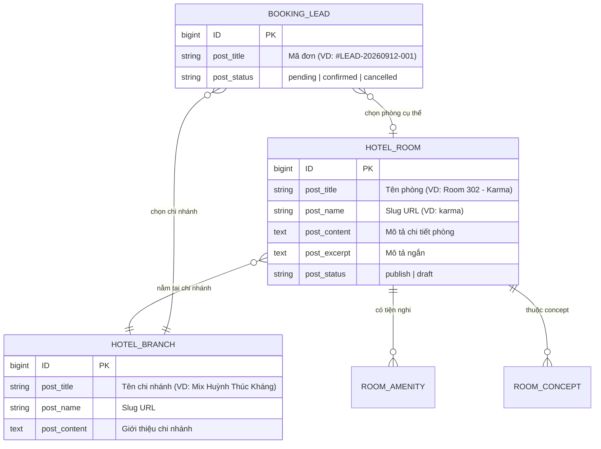

# DATABASE SCHEMA & DATA MODEL SPECIFICATION

> **Dự án:** Mix Boutique Hotel (`mixhotel.vn`)  
> **Tầng tài liệu:** Tầng 1 — Nghiệp vụ vĩ mô  
> **Quy chuẩn:** Chuẩn WordPress Core Database Architecture (Custom Post Types, Post Meta, Taxonomies).

---

## 1. SƠ ĐỒ THỰC THỂ QUAN HỆ (ERD)

---

## 2. CHI TIẾT CUSTOM POST TYPES & POST META

### 2.1. CPT `hotel_room` (Phòng Khách Sạn)
* **Slug Post Type:** `hotel_room`
* **Rewrite Slug:** `khach-san-tinh-yeu` (Đúng cấu trúc URL của `mixhotel.vn`)
* **Supports:** `['title', 'editor', 'thumbnail', 'excerpt']`
* **Danh sách Post Meta (`wp_postmeta`):**

| Meta Key | Kiểu dữ liệu | Mục đích | Ví dụ dữ liệu |
| :--- | :--- | :--- | :--- |
| `_mixhotel_room_code` | string | Mã phòng nội bộ | `302` |
| `_mixhotel_room_branch_id` | int | ID của CPT `hotel_branch` | `105` |
| `_mixhotel_price_first_2h` | int | Giá 2 giờ đầu (VNĐ) | `250000` |
| `_mixhotel_price_extra_hour` | int | Giá mỗi giờ tiếp theo (VNĐ) | `60000` |
| `_mixhotel_price_overnight` | int | Giá qua đêm (VNĐ) | `550000` |
| `_mixhotel_price_fullday` | int | Giá cả ngày đêm (VNĐ) | `80000` |
| `_mixhotel_room_gallery` | array/json | Mảng ID ảnh đính kèm | `[201, 202, 203]` |
| `_mixhotel_youtube_video_id` | string | ID video YouTube shorts phòng | `qyeqmaNJYbY` |
| `_mixhotel_is_featured` | boolean | Ghim ra trang chủ không | `1` |

---

### 2.2. CPT `hotel_branch` (Chi Nhánh Khách Sạn)
* **Slug Post Type:** `hotel_branch`
* **Rewrite Slug:** `chi-nhanh`
* **Supports:** `['title', 'editor', 'thumbnail']`
* **Danh sách Post Meta (`wp_postmeta`):**

| Meta Key | Kiểu dữ liệu | Mục đích | Ví dụ dữ liệu |
| :--- | :--- | :--- | :--- |
| `_mixhotel_branch_address` | string | Địa chỉ chi tiết | `256B Đặng Tiến Đông, Đống Đa, Hà Nội` |
| `_mixhotel_branch_hotline` | string | Số điện thoại bàn/hotline | `0393307030` |
| `_mixhotel_branch_hotline_tel` | string | Chuỗi tel link | `tel:+84393307030` |
| `_mixhotel_branch_zalo_url` | string | Link chat Zalo trực tiếp | `https://zalo.me/+84393307030` |
| `_mixhotel_branch_messenger_url` | string | Link Facebook Messenger | `https://m.me/111428390604292/` |
| `_mixhotel_branch_sms_tel` | string | Link gửi tin nhắn SMS | `sms:+84393307030` |
| `_mixhotel_branch_map_embed` | text | Mã iframe Google Maps | `<iframe src="..."></iframe>` |

---

### 2.3. CPT `booking_lead` (Yêu Cầu Giữ Phòng)
* **Slug Post Type:** `booking_lead`
* **Public:** `false` (Chỉ hiển thị trong WP-Admin cho Lễ tân và Quản lý)
* **Supports:** `['title']`
* **Danh sách Post Meta (`wp_postmeta`):**

| Meta Key | Kiểu dữ liệu | Mục đích | Ví dụ dữ liệu |
| :--- | :--- | :--- | :--- |
| `_mixhotel_lead_customer_name` | string | Họ tên khách hàng | `Nguyễn Văn A` |
| `_mixhotel_lead_customer_phone` | string | Số điện thoại | `0912345678` |
| `_mixhotel_lead_branch_id` | int | ID chi nhánh khách chọn | `105` |
| `_mixhotel_lead_demand` | string | Nhu cầu (Nghỉ giờ / Qua đêm / Kỷ niệm) | `Nghỉ giờ` |
| `_mixhotel_lead_note` | text | Ghi chú thêm từ khách | `Cần trang trí nến lãng mạn` |
| `_mixhotel_lead_status` | string | Trạng thái tiếp nhận | `pending` (Chờ gọi) / `confirmed` (Đã nhận) |
| `_mixhotel_lead_ip` | string | IP người gửi (chống spam) | `14.232.xxx.xxx` |

---

## 3. CHI TIẾT CUSTOM TAXONOMIES

### 3.1. Taxonomy `room_amenity` (Tiện Nghi Phòng)
* **Áp dụng cho:** `hotel_room`
* **Hierarchical:** `false` (Dạng Tag)
* **Danh sách mẫu:**
  * Bồn tắm Jacuzzi (`bon-tam-jacuzzi`)
  * Dụng cụ BDSM (`dung-cu-bdsm`)
  * Ghế tình yêu (`ghe-tinh-yeu`)
  * Smart TV có Netflix (`smart-tivi-netflix`)
  * Cosplay (`cosplay`)
  * Giường tròn (`giuong-tron`)
  * Gương trần (`guong-tran`)
  * Máy chiếu phim (`may-chieu-phim`)

### 3.2. Taxonomy `room_concept` (Phong Cách / Chủ Đề)
* **Áp dụng cho:** `hotel_room`
* **Hierarchical:** `true` (Dạng Danh mục)
* **Danh sách mẫu:**
  * Concept Huyền bí / Sexy (Karma, Katana)
  * Concept Lãng mạn / Luxury (Eden, Romantic)
  * Concept Nhật Bản (Geisha, Samurai)
  * Concept Châu Âu Cổ Điển
