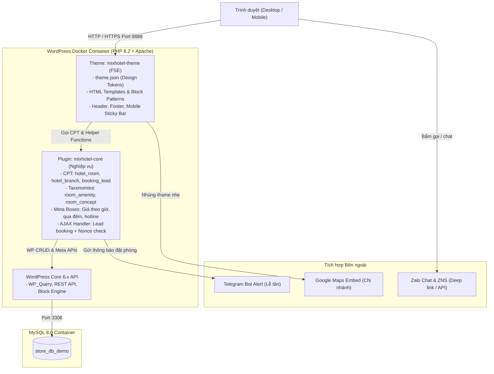
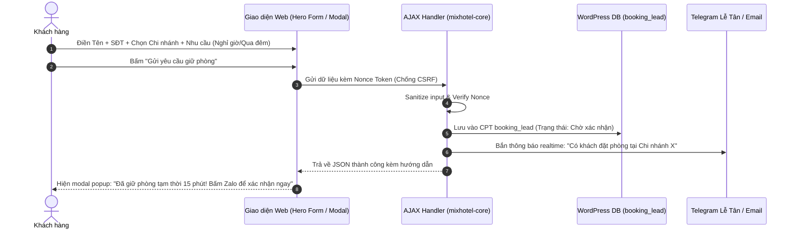

# SYSTEM ARCHITECTURE: MIX BOUTIQUE HOTEL CLONE

> **Dự án:** Clone giao diện và tính năng `https://mixhotel.vn`  
> **Phương pháp:** Disciplined Vibe Coding (Spec-Driven Development)  
> **Mục tiêu:** Hệ thống website WordPress chuẩn Agency, hiệu năng cao, dễ quản trị, sẵn sàng thương mại.

---

## 1. TỔNG QUAN KIẾN TRÚC HỆ THỐNG

Hệ thống được thiết kế theo mô hình **Tách biệt Trình diễn và Nghiệp vụ (Separation of Presentation & Business Logic)**:



---

## 2. NGUYÊN TẮC PHÂN TÁCH RANH GIỚI MÃ NGUỒN

1. **Thư mục Theme (`wp-content/themes/mixhotel-theme/`):**
   * **Chỉ chứa:**
     * `theme.json`: Toàn bộ Design Tokens (màu sắc, typography, spacing, border-radius, layout widths).
     * `style.css`: Khai báo metadata của theme và các style phụ trợ (reset, utility classes).
     * `templates/`: Các file cấu trúc giao diện (`front-page.html`, `single-hotel_room.html`, `archive-hotel_room.html`, `page.html`, `404.html`).
     * `parts/`: Template parts tái sử dụng (`header.html`, `footer.html`, `mobile-nav.html`).
     * `patterns/`: Các khối bố cục có sẵn (`hero-banner.html`, `room-card.html`, `branch-pricing.html`, `video-grid.html`).
   * **Cam kết:** Nếu người dùng đổi sang theme khác, toàn bộ dữ liệu phòng, chi nhánh và danh sách khách đặt phòng **KHÔNG BAO GIỜ BỊ MẤT**.

2. **Thư mục Plugin Nghiệp Vụ (`wp-content/plugins/mixhotel-core/`):**
   * **Chỉ chứa:**
     * Khai báo Custom Post Types (`hotel_room`, `hotel_branch`, `booking_lead`).
     * Khai báo Custom Taxonomies (`room_amenity`, `room_concept`).
     * Custom Fields & Meta Boxes (bảng giá phòng, số điện thoại hotline từng chi nhánh, link Zalo).
     * Xử lý gửi Form AJAX đặt phòng và bảo mật Nonce.
     * Tích hợp Webhook / Telegram Bot gửi thông báo đến lễ tân.

3. **Thư mục Tải lên (`wp-content/uploads/`):**
   * Chứa hình ảnh phòng, banner, logo. Thư mục này nằm ngoài Git tracking để tránh làm phình repo code.

4. **Danh Sách Plugin Bên Thứ Ba Được Phê Duyệt (Approved 3rd-party Plugins):**
   * **Spectra (`ultimate-addons-for-gutenberg`):** Cung cấp thư viện Block nâng cao (Container, Grid, Tabs) phục vụ trải nghiệm biên tập No-code khi quản trị viên tạo trang mới trong Block Editor. Các trang cốt lõi (Trang chủ, Chi tiết phòng, Danh mục phòng) duy trì vận hành trên FSE Native Block Patterns để tối ưu Core Web Vitals và đạt tốc độ tải cao nhất.
   * **Rank Math SEO (`seo-by-rank-math`):** Quản lý thẻ meta OpenGraph, chấm điểm bài viết chuẩn SEO, tự động tạo XML Sitemap và sinh cấu trúc Schema `LodgingBusiness` cho khách sạn.
   * **Converter for Media (`webp-converter-for-media`):** Tự động chuyển đổi toàn bộ ảnh tải lên thư viện Media sang định dạng WebP/AVIF siêu nhẹ.
   * **UpdraftPlus (`updraftplus`):** Công cụ sao lưu tự động (Backup & Restore) CSDL và mã nguồn định kỳ lên Google Drive trước khi bàn giao.

---

## 3. CƠ CHẾ BOOKING LEAD ENGINE

Khác với các website thương mại thông thường dùng giỏ hàng phức tạp, `mixhotel.vn` là mô hình khách sạn cặp đôi / nghỉ giờ, yêu cầu **tốc độ phản hồi và tính bảo mật riêng tư cao nhất**:



---

## 4. HẠ TẦNG DOCKER & PORT MAPPING

Dự án vận hành trên 3 containers độc lập thông qua file [docker-compose.yml](file:///c:/Users/maida/Code/wordpress/docker-compose.yml):

* **WordPress Container (`store_app`):** Chạy Apache + PHP 8.2, port `8888:80`.
* **Database Container (`store_db`):** Chạy MySQL 8.0, port `3307:3306` (đã mở cổng `3307` để kết nối DBeaver / Navicat).
* **phpMyAdmin Container (`store_pma`):** Chạy phpMyAdmin, port `8889:80`.

---

## 5. CHIẾN LƯỢC FSE REFACTOR (Feature 06 — No-code Admin UI)

> **Spec Kit:** `specs/06-fse-gutenberg-refactor/` (spec.md, plan.md, tasks.md)  
> **Governing Documents:** `REAL_WORLD_AGENCY_WORKFLOW.md` (Mục 6, 7.3, 7.4, 9.4), `AGENTS.md` (Mục 2, 3)

### 5.1. Tình Trạng Kiến Trúc Hiện Tại (Technical Debt)

Toàn bộ Block Patterns và phần lớn Template Parts trong `mixhotel-theme/` sử dụng `<!-- wp:html -->` (Custom HTML Block) bao trùm toàn bộ nội dung section. Kỹ thuật này đảm bảo pixel-perfect khi chuyển đổi từ Next.js prototype nhưng gây ra **4 hệ quả nghiêm trọng:**

1. **Không Click-to-Edit:** Admin không thể sửa text (tiêu đề, giá, mô tả) trực tiếp trong Site Editor.
2. **Không Replace Image:** Ảnh hero, sự kiện, phòng concept đều là thẻ `` tĩnh, không có nút "Replace" của Gutenberg.
3. **Không Inspector Controls:** Không đổi được màu nền, font chữ, padding qua panel bên phải.
4. **Không Kéo Thả:** Admin không thể kéo đổi vị trí section hoặc thêm block mới.

### 5.2. Chiến Lược CSS Preservation

```
  NGUYÊN TẮC BẤT BIẾN:
  ├── KHÔNG XÓA bất kỳ file CSS hiện có
  ├── KHÔNG ĐỔI TÊN class CSS hiện có
  ├── GẮN class CSS cũ vào Core Blocks qua "className" attribute
  ├── CHỈ BỔ SUNG CSS resets cho wp-block-* defaults nếu gây xung đột
  └── TẠO utility classes mới thay cho inline styles bị xóa
```

### 5.3. Phân Loại Components

| Nhóm | Hành động | Ví dụ |
|:---|:---|:---|
| **A: Static Content** (23 patterns + 2 parts) | Chuyển `wp:html` → Core Blocks | `why-choose-us`, `pricing-table`, `booking-steps`, `final-cta`, `events-decoration`, `about-*`, `policy-*`, Header/Footer logo |
| **B: Dynamic PHP** (9 patterns) | Giữ nguyên `wp:html` → Feature 07 | `concept-rooms`, `branches-list`, `room-detail-content`, `room-archive-content`, `branch-detail`, `blog-*`, `gallery-grid` |
| **C: Interactive UI** (4 parts) | Giữ nguyên `wp:html` | `mobile-action-bar`, `desktop-contact-bar`, `contact-modal`, `booking-modal` |

### 5.4. Quyết Định Kiến Trúc (ADR-006)

* **Progressive Migration:** 4 Waves bắt đầu từ POC (2 components đơn giản nhất) → kiểm chứng → mở rộng.
* **Navigation Block Deferred:** Header menu giữ raw HTML thay vì `<!-- wp:navigation -->` vì WordPress 6.x chưa hỗ trợ tốt multi-level dropdown custom styling. Chỉ đổi Logo → `<!-- wp:site-logo -->`.
* **Layout Lock:** Section wrappers sử dụng `"lock":{"move":true,"remove":true}` ngăn Admin xóa/kéo nhầm bố cục.
* **Buttons CTA:** Các nút có `data-contact-action` giữ trong `<!-- wp:html -->` vì cần Vanilla JS dispatcher.

