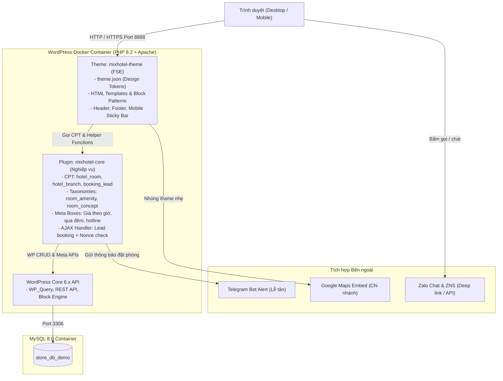
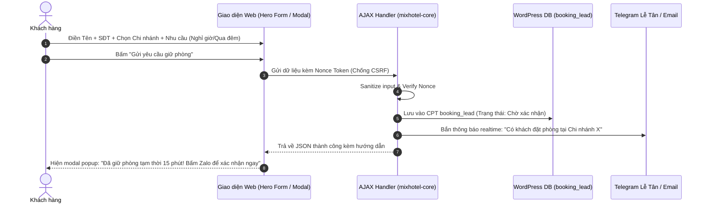

# SYSTEM ARCHITECTURE: MIX BOUTIQUE HOTEL CLONE

> **Dự án:** Clone giao diện và tính năng `https://mixhotel.vn`  
> **Phương pháp:** Disciplined Vibe Coding (Spec-Driven Development)  
> **Mục tiêu:** Hệ thống website WordPress chuẩn Agency, hiệu năng cao, dễ quản trị, sẵn sàng thương mại.

---

## 1. TỔNG QUAN KIẾN TRÚC HỆ THỐNG

Hệ thống được thiết kế theo mô hình **Tách biệt Trình diễn và Nghiệp vụ (Separation of Presentation & Business Logic)**:

---

## 2. NGUYÊN TẮC PHÂN TÁCH RANH GIỚI MÃ NGUỒN

1. **Thư mục Theme (`wp-content/themes/mixhotel-theme/`):**
   * **Chỉ chứa:**
     * `theme.json`: Toàn bộ Design Tokens (màu sắc, typography, spacing, border-radius, layout widths).
     * `style.css`: Khai báo metadata của theme và các style phụ trợ (reset, utility classes).
     * `templates/`: Các file cấu trúc giao diện (`front-page.html`, `single-hotel_room.html`, `archive-hotel_room.html`, `page.html`, `404.html`).
     * `parts/`: Template parts tái sử dụng (`header.html`, `footer.html`, `mobile-nav.html`).
     * `patterns/`: Các khối bố cục có sẵn (`hero-banner.html`, `room-card.html`, `branch-pricing.html`, `video-grid.html`).
   * **Cam kết:** Nếu người dùng đổi sang theme khác, toàn bộ dữ liệu phòng, chi nhánh và danh sách khách đặt phòng **KHÔNG BAO GIỜ BỊ MẤT**.

2. **Thư mục Plugin Nghiệp Vụ (`wp-content/plugins/mixhotel-core/`):**
   * **Chỉ chứa:**
     * Khai báo Custom Post Types (`hotel_room`, `hotel_branch`, `booking_lead`).
     * Khai báo Custom Taxonomies (`room_amenity`, `room_concept`).
     * Custom Fields & Meta Boxes (bảng giá phòng, số điện thoại hotline từng chi nhánh, link Zalo).
     * Xử lý gửi Form AJAX đặt phòng và bảo mật Nonce.
     * Tích hợp Webhook / Telegram Bot gửi thông báo đến lễ tân.

3. **Thư mục Tải lên (`wp-content/uploads/`):**
   * Chứa hình ảnh phòng, banner, logo. Thư mục này nằm ngoài Git tracking để tránh làm phình repo code.

---

## 3. CƠ CHẾ BOOKING LEAD ENGINE

Khác với các website thương mại thông thường dùng giỏ hàng phức tạp, `mixhotel.vn` là mô hình khách sạn cặp đôi / nghỉ giờ, yêu cầu **tốc độ phản hồi và tính bảo mật riêng tư cao nhất**:

---

## 4. HẠ TẦNG DOCKER & PORT MAPPING

Dự án vận hành trên 3 containers độc lập thông qua file [docker-compose.yml](file:///c:/Users/maida/Code/wordpress/docker-compose.yml):

* **WordPress Container (`store_app`):** Chạy Apache + PHP 8.2, port `8888:80`.
* **Database Container (`store_db`):** Chạy MySQL 8.0, port `3307:3306` (đã mở cổng `3307` để kết nối DBeaver / Navicat).
* **phpMyAdmin Container (`store_pma`):** Chạy phpMyAdmin, port `8889:80`.
