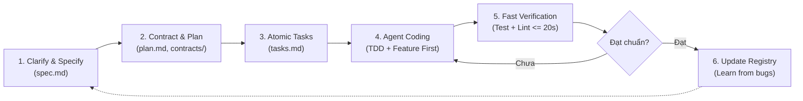

# Playbook: Disciplined Vibe Coding với Spec-Driven Development (SDD)

> Cẩm nang thực chiến đúc kết từ dự án **Rizzy Dating App** nhằm biến các tài liệu phân tích nghiệp vụ (PA - Project Assignment / Product Analyst) thành hệ thống chỉ dẫn chuẩn mực, giúp AI Agent lập trình mượt mà ("vibe coding") nhưng vẫn bảo đảm kỷ luật kỹ thuật, tính toàn vẹn kiến trúc và chất lượng kiểm thử.

---

## 1. Triết lý cốt lõi: Disciplined Vibe Coding là gì?

"Vibe coding" không đồng nghĩa với việc prompt tùy tiện, copy-paste mù quáng và liên tục vá víu lỗi run-time. Khi dự án vượt qua ngưỡng MVP nhỏ, "Chaos Vibe Coding" sẽ dẫn đến bế tắc: Agent bị ảo giác (hallucination), tự bịa model/API, làm vỡ layout giao diện và phá vỡ cấu trúc cơ sở dữ liệu.

Mô hình **Disciplined Vibe Coding** giải quyết triệt để vấn đề này bằng cách kết hợp sức mạnh sinh code của LLM với phương pháp **Spec-Driven Development (SDD)**:



* **Doc là bộ ray (Guardrails)**: AI Agent chỉ sáng tạo trong phạm vi tài liệu quy định.
* **Contract-First**: Khóa chặt cấu trúc dữ liệu và API interface trước khi viết hàm logic.
* **Test-First (TDD)**: Viết test case trước khi viết implementation để Agent có căn cứ tự sửa lỗi.
* **Trí nhớ dài hạn (Bug Memory)**: Mọi bug đã sửa phải được ghi chép vào kho tri thức để Agent không lặp lại.

---

## 2. Kiến trúc 3 tầng tài liệu (Documentation Architecture)

Để AI Agent không bị "ngợp" context hoặc thiếu thông tin, tài liệu cần được tổ chức thành 3 tầng:

| Tầng | Vai trò | Vị trí khuyến nghị | Nội dung chính |
| :--- | :--- | :--- | :--- |
| **Tầng 1: Nghiệp vụ vĩ mô** | Định hình bài toán, ranh giới sản phẩm, quyết định kiến trúc | `docs/` | Proposal, System Architecture, Use-Case Models, DB Schemas, Changes log. |
| **Tầng 2: Gói đặc tả tính năng (Spec Kit)** | Ngữ cảnh khép kín cho từng Feature độc lập | `specs/<feature>/` | `spec.md`, `plan.md`, `contracts/`, `data-model.md`, `tasks.md`, `quickstart.md`. |
| **Tầng 3: Luật Agent & Bộ nhớ chống lỗi** | Giới hạn hành vi, quy tắc code, danh mục chống tái diễn lỗi | `AGENTS.md`, `.agents/skills/` | Thứ bậc chân lý, quy tắc branch/commit, bộ sưu tập anti-patterns (Bug Prevention). |

---

## 3. Quy trình 6 bước triển khai cho mọi dự án

### Bước 1: Thiết lập Luật bất di bất dịch (`AGENTS.md`)
Tạo file `AGENTS.md` tại thư mục gốc của repository làm System Prompt mặc định cho toàn bộ Agent:
* **Thứ bậc chân lý (Hierarchy of Truth)**: Khi tài liệu và code mâu thuẫn, nguồn nào có quyền ưu tiên cao nhất? (Khuyến nghị: *Chỉ dẫn trực tiếp của User $\rightarrow$ AGENTS.md $\rightarrow$ Roadmap/Spec hiện hành $\rightarrow$ Source code/Migration hiện có*).
* **Ràng buộc công nghệ**: Khai báo phiên bản framework, state management chính, cấm tự ý cài package mới mà không báo trước.
* **Ranh giới an toàn**: Tuyệt đối không hardcode Service Role Key, Database Secret hay API Secret trên client.
* **Quy chuẩn mã nguồn**: Bắt buộc dùng Design Tokens (màu, typography, spacing), cấm hardcode mã màu tùy tiện.

### Bước 2: Xây dựng "Sổ tay chống bug" (`<app>-bug-prevention`)
Lập một thư mục tri thức chứa các lỗi thường gặp của tech stack dự án (ví dụ trong Flutter: `RenderFlex overflow`, `Riverpod lifecycle disposal`, `BorderRadius conflict`):
* Mỗi khi sửa xong 1 lỗi khó chịu, tạo 1 mục gồm:
  1. *Triệu chứng / Log lỗi*.
  2. *Nguyên nhân cốt lõi*.
  3. *Code SAI vs Code ĐÚNG*.
* **Cách dùng**: Mỗi lần giao task UI hoặc Backend cho Agent, yêu cầu Agent: *"Đọc skill bug-prevention trước khi viết code"*.

### Bước 3: Soạn đặc tả tính năng (`spec.md`)
Không giao yêu cầu bằng một đoạn chat bâng quơ. Tạo file `spec.md` gồm 3 phần bắt buộc:
1. **Clarifications (Hỏi đáp gỡ ambiguity)**: Trả lời dứt khoát các trường hợp phân vân (VD: thuật toán sắp xếp, cách tính khoảng cách khi mất GPS, xử lý like/pass duplicate).
2. **User Stories theo chuẩn Gherkin**:
   ```gherkin
   Given: Người dùng đã hoàn thành onboarding
   When: Người dùng quẹt phải (Like)
   Then: Quyết định được lưu, thẻ tiếp theo xuất hiện ngay lập tức (optimistic UI)
   ```
3. **Edge Cases**: Liệt kê trước ít nhất 4–5 trường hợp biên (mất mạng đột ngột, thao tác spam nhiều lần, đối tượng bị khóa tài khoản giữa chừng).

### Bước 4: Khóa hợp đồng dữ liệu (`contracts/` & `data-model.md`)
Trước khi bắt Agent viết UI hay Controller, bắt buộc Agent viết hoặc chốt Interface:
* **Database/Backend Contract**: Bảng SQL, RLS Policy, RPC functions, REST/GraphQL Schema.
* **Frontend Contract**: Data Model class, Repository Interface (DTO, Request/Response typing).
* **Lợi ích**: Agent không bao giờ "tưởng tượng" ra một method không tồn tại ở backend.

### Bước 5: Phân rã Task nguyên tử và gắn cứng đường dẫn (`tasks.md`)
Task list phải tuân theo quy tắc:
* **Phân phase rõ ràng**: *Setup $\rightarrow$ Foundational (DB/Model/Provider) $\rightarrow$ User Stories (Test trước $\rightarrow$ Code sau) $\rightarrow$ Polish*.
* **Path-Binding**: Mọi task phải có file path cụ thể, ví dụ:
  * `[X] T008 [P] Tạo DiscoveryCandidateModel tại lib/data/models/discovery_candidate_model.dart`
  * `[X] T019 [US1] Viết unit test mapper tại test/data/repositories/discovery_row_mapper_test.dart`
  * `[X] T022 [US1] Triển khai logic nạp dữ liệu tại lib/data/repositories/discovery_repository_impl.dart`
* Gắn cờ `[P]` cho các task độc lập có thể chạy song song.

### Bước 6: Vòng lặp Vibe & Verify (Fast Feedback Loop)
Cho Agent thực thi tuần tự từng task trong `tasks.md`:
1. Agent đọc task $\rightarrow$ Viết code/test tương ứng.
2. Chạy ngay lệnh kiểm chứng (lệnh chạy không quá 20s):
   * Phía code: `flutter test <file_test_vừa_viết>` / `npm test`
   * Phía linter: `flutter analyze` / `npm run lint`
   * Phía DB: `supabase db reset`
3. Nếu pass $\rightarrow$ Tick `[X]` vào `tasks.md` $\rightarrow$ Chuyển task tiếp theo.
4. Nếu fail $\rightarrow$ Yêu cầu Agent tự đọc log lỗi, sửa lại cho đến khi pass.

---

## 4. Các mẫu tài liệu chuẩn (Templates)

### Template A: `spec.md`

```markdown
# Feature Specification: [Tên tính năng]

**Feature Branch**: `feat/<id>-<ten-ngan-gon>`
**Status**: Ready for Planning

## 1. Clarifications
- Q: [Vấn đề còn mơ hồ 1]? -> A: [Quyết định dứt khoát].
- Q: [Vấn đề còn mơ hồ 2]? -> A: [Quyết định dứt khoát].

## 2. User Scenarios & Acceptance Criteria
### User Story 1 - [Tên hành vi chính] (Priority: P1)
Mô tả: Là [Actor], tôi muốn [Hành động] để [Mục đích].
**Acceptance Scenarios (Gherkin)**:
1. **Given** [Điều kiện tiền đề], **When** [Thao tác kích hoạt], **Then** [Kết quả mong đợi].
2. **Given** [Dữ liệu không hợp lệ], **When** [Bấm submit], **Then** [Thông báo lỗi hiển thị rõ ràng].

## 3. Edge Cases
- [Tình huống biên 1: Mất kết nối mạng giữa chừng].
- [Tình huống biên 2: Nhấn nút liên tục / Double submit].
- [Tình huống biên 3: Dữ liệu bị xóa từ phía người dùng khác].

## 4. Requirements
- **FR-001**: Hệ thống PHẢI [Yêu cầu chức năng cụ thể].
- **NFR-001**: Thời gian phản hồi PHẢI dưới 500ms trong điều kiện bình thường.
```

---

### Template B: `tasks.md`

```markdown
# Tasks: [Tên tính năng]

**Input**: `spec.md`, `plan.md`, `contracts/`
**Quy tắc**: Viết test trước, code sau. Mỗi task gắn chính xác đường dẫn file.

## Phase 1: Foundational (Chặn mọi story tiếp theo)
- [ ] T001 Tạo migration DB tại `supabase/migrations/<timestamp>_<feature>.sql`
- [ ] T002 Kiểm tra migration với lệnh `supabase db reset`
- [ ] T003 [P] Tạo Model tại `lib/data/models/<feature>_model.dart`
- [ ] T004 [P] Tạo Interface Repository tại `lib/domain/repositories/<feature>_repository.dart`

## Phase 2: User Story 1 - [Tên Story 1]
### Tests for Story 1
- [ ] T005 [P] Viết unit test repository tại `test/data/repositories/<feature>_repository_test.dart`
- [ ] T006 [P] Viết controller test tại `test/features/<feature>/application/<feature>_controller_test.dart`

### Implementation for Story 1
- [ ] T007 Triển khai Repository tại `lib/data/repositories/<feature>_repository_impl.dart`
- [ ] T008 Triển khai Controller/State tại `lib/features/<feature>/application/<feature>_controller.dart`
- [ ] T009 Hoàn thiện UI Widget tại `lib/features/<feature>/presentation/widgets/<feature>_widget.dart`

## Phase 3: Verification & Polish
- [ ] T010 Chạy toàn bộ test suite của feature và kiểm tra lint
- [ ] T011 Ghi nhận lỗi phát sinh (nếu có) vào bug-prevention skill
```

---

### Template C: Mục ghi nhận lỗi (`bug-prevention-entry.md`)

```markdown
### [Mã/Tên lỗi]: [Tên ngắn gọn của bug]
* **Mô tả lỗi**: [Thông báo lỗi từ console hoặc hiện tượng vỡ giao diện]
* **Nguyên nhân gốc rễ (Root Cause)**: [Giải thích vì sao lỗi xảy ra theo cơ chế nội bộ của framework]
* **Quy tắc phòng ngừa**:
  * KHÔNG: [Mô tả đoạn code sai hoặc pattern sai]
  * PHẢI: [Mô tả cách xử lý chuẩn mực]
* **Code so sánh**:
```dart
// ❌ SAI: Dễ gây tràn màn hình khi mở bàn phím
Column(
  children: [
    Expanded(child: MessageList()),
    SuggestionPanel(), // Không bị giới hạn chiều cao
    MessageComposer(),
  ],
)

// ✅ ĐÚNG: Giới hạn chiều cao độc lập và bọc scroll
Column(
  children: [
    Expanded(child: MessageList()),
    ConstrainedBox(
      constraints: BoxConstraints(maxHeight: 120),
      child: SingleChildScrollView(child: SuggestionPanel()),
    ),
    MessageComposer(),
  ],
)
```
```

---

## 5. Mẫu Prompting thực chiến theo Persona

| Tình huống | Mẫu Prompt khuyến nghị |
| :--- | :--- |
| **Khi khởi tạo Spec** | *"Đóng vai trò Product Analyst (PA), hãy đọc tài liệu yêu cầu tại `docs/...` và lập `spec.md` cho feature [X]. Liệt kê rõ Clarifications gỡ bỏ mọi điểm mơ hồ, viết User Stories theo chuẩn Gherkin và chỉ ra ít nhất 5 Edge Cases."* |
| **Khi lập Kế hoạch & Kiến trúc** | *"Đóng vai trò Software Architect, hãy đọc `spec.md` và lập `plan.md` cùng các file trong `contracts/`. Kiểm tra tính tuân thủ với `AGENTS.md` (Constitution Check), khóa chặt schema DB, RLS policies và model interfaces."* |
| **Khi sinh Task list** | *"Hãy bẻ nhỏ `plan.md` thành `tasks.md` theo thứ tự phụ thuộc. Bắt buộc: mỗi task phải có đường dẫn file chính xác, áp dụng TDD (viết test task trước implementation task), và gắn cờ `[P]` cho các task độc lập."* |
| **Khi thực thi Code** | *"Đọc task [T008] trong `tasks.md`. Trước khi viết code, hãy đọc `.agents/skills/<app>-bug-prevention/` để tránh các lỗi đã biết. Sau khi viết xong, tự chạy lệnh kiểm thử để xác nhận trước khi tick [X]."* |
| **Khi Review chất lượng** | *"Đóng vai trò Chuyên gia QA & Security Reviewer, hãy phân tích đoạn code vừa viết. Đánh giá xem có vi phạm ranh giới bảo mật RLS, rò rỉ bộ nhớ (lifecycle leak), hoặc thiếu test case cho các edge case trong `spec.md` không."* |

---

## 6. Tổng kết bảng so sánh

| Tiêu chí | Chaos Vibe Coding | Disciplined Vibe Coding (SDD) |
| :--- | :--- | :--- |
| **Điểm bắt đầu** | Prompt tự do trên khung chat | `spec.md` & `plan.md` rõ ràng |
| **Định nghĩa API/Model** | Agent tự bịa trong lúc gõ code | Chốt cứng trong `contracts/` trước |
| **Quy mô thay đổi** | Sinh hàng loạt file một lúc | Từng task nguyên tử trong `tasks.md` |
| **Kiểm tra lỗi** | Nhìn bằng mắt thường trên màn hình | Unit/Widget Test tự động + Linter |
| **Khi gặp bug mới** | Fix tạm bợ, sau đó bug lặp lại | Lưu vào `bug-prevention` registry |
| **Khả năng mở rộng** | Sụp đổ khi project đạt >10 màn hình | Mở rộng ổn định lên hàng chục feature |
