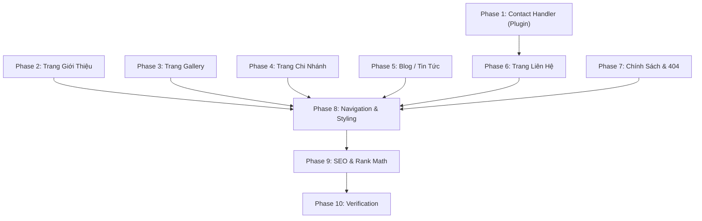

# IMPLEMENTATION PLAN: 05 - AUXILIARY PAGES & POLISH

**Feature:** `specs/05-auxiliary-pages-and-polish`  
**Tuân thủ:** `playbook_disciplined_vibe_coding.md` & `AGENTS.md`  
**Trọng tâm:** FSE Templates, Block Patterns, Custom AJAX Contact Handler, Navigation update, Blog Archive, Branch Detail, SEO Schema, 404 Page, Styling & Polish.

---

## 1. ARCHITECTURE OVERVIEW

```
[WordPress FSE Block Templates]
    ├── page-gioi-thieu.html ──> Pattern: about-intro.php, about-amenities.php, about-testimonials.php, about-gallery.php
    ├── page-gallery.html ──> Pattern: gallery-grid.php (WP_Query → hotel_room gallery images)
    ├── page-lien-he.html ──> Pattern: contact-form.php, contact-info.php, contact-maps.php
    ├── single-hotel_branch.html ──> Pattern: branch-detail.php (WP_Query → rooms by branch_id)
    ├── home.html (Blog Archive) ──> Core Query Loop Block + Categories sidebar
    ├── single.html (Blog Post) ──> Core Post Content + Post Featured Image
    ├── page.html (Generic Page) ──> Dùng cho trang Chính sách
    └── 404.html ──> Pattern: 404-content.php

[Plugin: mixhotel-core]
    └── class-contact-handler.php (Mới)
        ├── wp_ajax_nopriv_mixhotel_submit_contact
        ├── wp_ajax_mixhotel_submit_contact
        ├── Nonce + Honeypot + Rate-limiting (tái sử dụng pattern từ Booking Handler)
        └── Demo Sandbox: Lưu log mô phỏng email

[Theme: mixhotel-theme]
    ├── assets/js/contact-form.js (Mới) — Vanilla JS xử lý submit form liên hệ
    ├── assets/css/pages.css (Mới) — Styles cho các trang phụ trợ
    └── functions.php — Enqueue CSS/JS mới, đăng ký thêm template parts
```

---

## 2. PHASES OF EXECUTION

### Phase 1: Plugin — Contact Form AJAX Handler
- `wp-content/plugins/mixhotel-core/includes/class-contact-handler.php` (Mới)
  - Đăng ký `wp_ajax_nopriv_mixhotel_submit_contact` và `wp_ajax_mixhotel_submit_contact`
  - Nonce verification với action `mixhotel_contact_nonce`
  - Honeypot check (tái sử dụng `mixhotel_hp_email`, `website_url`)
  - Rate limiting: 3 requests / 10 phút per IP (strict hơn booking vì form liên hệ ít dùng hơn)
  - Sanitize: `sanitize_text_field` (tên, email), `sanitize_textarea_field` (nội dung)
  - Validate: Email qua `is_email()`, SĐT regex VN
  - Demo Sandbox Mode:
    - Bật: Lưu bản ghi vào `mixhotel_demo_contact_log` + ghi `WP_DEBUG_LOG`
    - Tắt: `wp_mail()` gửi email thật tới admin
  - Return: `wp_send_json_success()` / `wp_send_json_error()`
- Cập nhật `wp-content/plugins/mixhotel-core/mixhotel-core.php`
  - Require `class-contact-handler.php` và init hooks

---

### Phase 2: Theme — Trang Giới Thiệu
- `wp-content/themes/mixhotel-theme/patterns/about-intro.php` (Mới)
  - Section Hero giới thiệu: Tiêu đề "GIỚI THIỆU VỀ KHÁCH SẠN TÌNH YÊU", slogan italic, nội dung text mô tả, ảnh giới thiệu lớn (Core Image Block + Cover Block).
- `wp-content/themes/mixhotel-theme/patterns/about-amenities.php` (Mới)
  - Grid 6 icon tiện nghi: Columns Block 6 cột (3 cột trên mobile), mỗi cột gồm Image Block + Heading. Theo bố cục website gốc: WiFi, Bồn tắm, Cosplay, An toàn, Đồ chơi, Dịch vụ.
- `wp-content/themes/mixhotel-theme/patterns/about-video.php` (Mới)
  - YouTube embed responsive dùng Core Embed Block (wp:embed với provider YouTube).
- `wp-content/themes/mixhotel-theme/patterns/about-testimonials.php` (Mới)
  - Grid 2×3 card đánh giá khách hàng. Mỗi card: Avatar (Core Image Block rounded), Tên + Chức danh (Paragraph bold), Rating sao (Unicode ★ hoặc SVG), Nội dung đánh giá (Paragraph). Tất cả editable No-code.
- `wp-content/themes/mixhotel-theme/patterns/about-gallery.php` (Mới)
  - Carousel/Gallery ảnh dùng Core Gallery Block với lightbox (WordPress 6.4+ hỗ trợ native lightbox).
- `wp-content/themes/mixhotel-theme/templates/page-gioi-thieu.html` (Mới)
  - Nhúng Header → Breadcrumb → about-intro → about-amenities → about-video → about-testimonials → about-gallery → Footer.

---

### Phase 3: Theme — Trang Gallery
- `wp-content/themes/mixhotel-theme/patterns/gallery-grid.php` (Mới)
  - PHP pattern sử dụng `WP_Query` lấy tất cả `hotel_room` (status=publish), hiển thị dạng grid card:
    - Featured Image thumbnail
    - Tên phòng (Post Title)
    - Link → `single-hotel_room`
  - Nhóm theo chi nhánh: Hiển thị heading tên chi nhánh, dưới đó là grid các phòng thuộc chi nhánh.
  - Pagination WordPress chuẩn (`paginate_links()`).
- `wp-content/themes/mixhotel-theme/templates/page-gallery.html` (Mới)
  - Nhúng Header → Breadcrumb → gallery-grid → Footer.

---

### Phase 4: Theme — Trang Chi Nhánh Chi Tiết
- `wp-content/themes/mixhotel-theme/patterns/branch-detail.php` (Mới)
  - PHP pattern render nội dung chi nhánh:
    - Hero: Featured Image + Tên chi nhánh overlay
    - Nội dung editor (Block content) từ `the_content()`
    - Block thông tin liên hệ: Hotline (link `tel:`), Zalo, Messenger — lấy từ post meta
    - Danh sách phòng thuộc chi nhánh: `WP_Query` WHERE `_mixhotel_room_branch_id` = current branch ID. Hiển thị card grid.
    - Google Maps embed: Render `_mixhotel_branch_map_embed` meta (escape bằng `wp_kses` cho phép iframe).
- `wp-content/themes/mixhotel-theme/templates/single-hotel_branch.html` (Mới)
  - Nhúng Header → Breadcrumb → branch-detail → Footer.

---

### Phase 5: Theme — Blog / Tin Tức
- `wp-content/themes/mixhotel-theme/patterns/blog-sidebar.php` (Mới)
  - Sidebar column: Danh mục bài viết (wp:categories), Bài viết mới nhất (wp:latest-posts limit 5).
- `wp-content/themes/mixhotel-theme/templates/home.html` (Mới)
  - Template cho blog archive (WordPress dùng `home.html` cho Posts Page).
  - Layout 2 cột: Main (Query Loop Block → Card bài viết: Featured Image, Title link, Date, Excerpt, Category badge) + Sidebar (blog-sidebar pattern).
  - Pagination chuẩn WordPress.
- `wp-content/themes/mixhotel-theme/templates/single.html` (Mới)
  - Template cho bài viết chi tiết.
  - Breadcrumb → Featured Image → Title → Meta (Date, Category) → Post Content → Sidebar.

---

### Phase 6: Theme — Trang Liên Hệ
- `wp-content/themes/mixhotel-theme/patterns/contact-form.php` (Mới)
  - Form HTML: Họ tên*, SĐT*, Email*, Nội dung textarea. Nút "Gửi".
  - Honeypot hidden fields (giống Booking form).
  - Nonce field (`wp_nonce_field( 'mixhotel_contact_nonce', '_mixhotel_contact_nonce' )`).
- `wp-content/themes/mixhotel-theme/patterns/contact-info.php` (Mới)
  - Thông tin công ty: Tên doanh nghiệp, GPKD, địa chỉ các chi nhánh (No-code editable text).
  - Hotline, Email, Social links (Facebook, YouTube, Instagram).
- `wp-content/themes/mixhotel-theme/patterns/contact-maps.php` (Mới)
  - Grid Google Maps embed các chi nhánh. Lấy từ `WP_Query` tất cả `hotel_branch` + meta `_mixhotel_branch_map_embed`.
- `wp-content/themes/mixhotel-theme/templates/page-lien-he.html` (Mới)
  - Nhúng Header → Breadcrumb → contact-form + contact-info (2 cột) → contact-maps → Footer.
- `wp-content/themes/mixhotel-theme/assets/js/contact-form.js` (Mới)
  - Vanilla JS: Bắt submit event, client validation, loading state, fetch AJAX tới `MixHotelData.ajaxUrl` action `mixhotel_submit_contact`, hiển thị success/error message.

---

### Phase 7: Theme — Trang Chính Sách & Trang 404
- Cập nhật `wp-content/themes/mixhotel-theme/templates/page.html` (Sửa)
  - Template generic cho WordPress Pages. Thêm breadcrumb, đảm bảo styling Dark Luxury cho nội dung text dài (headings, paragraphs, lists).
- `wp-content/themes/mixhotel-theme/templates/404.html` (Sửa/Tạo mới)
  - Illustration "404" cách điệu (CSS art hoặc SVG inline, không hardcode image URL).
  - Text: "Trang bạn tìm không tồn tại hoặc đã được di chuyển."
  - 2 nút CTA: "Về Trang Chủ" (`/`), "Xem Phòng" (`/khach-san-tinh-yeu/`).
  - Styling nhất quán Dark Luxury.

---

### Phase 8: Theme — Navigation Update & Styling
- Cập nhật `wp-content/themes/mixhotel-theme/parts/header.html` (Sửa)
  - Bổ sung các menu item mới vào navigation: Giới Thiệu, Gallery, Tin Tức (với dropdown sub-categories), Chính Sách (với dropdown 3 trang), Liên Hệ.
  - Đảm bảo dropdown hoạt động đúng trên cả Desktop và Mobile.
- Cập nhật `wp-content/themes/mixhotel-theme/parts/footer.html` (Sửa)
  - Bổ sung link trang Chính sách vào cột Footer.
  - Bổ sung link Giới thiệu, Gallery, Liên hệ vào cột "Thông tin hỗ trợ".
- `wp-content/themes/mixhotel-theme/assets/css/pages.css` (Mới)
  - Styles cho trang Giới thiệu: about-intro, amenities grid, testimonials cards.
  - Styles cho trang Gallery: gallery-grid, card hover effects.
  - Styles cho trang Liên hệ: contact-form, contact-info, maps grid.
  - Styles cho trang Blog: blog-card, sidebar, single-post.
  - Styles cho trang Branch: branch-hero, rooms-grid, map-embed.
  - Styles cho trang 404: centered layout, illustration.
  - Styles cho trang Chính sách: prose typography.
  - **Tất cả sử dụng CSS Variables** từ `theme.json` Design Tokens (`--wp--preset--color--*`, `--wp--preset--font-size--*`, `--wp--preset--spacing--*`).
- Cập nhật `wp-content/themes/mixhotel-theme/functions.php` (Sửa)
  - Enqueue `pages.css` và `contact-form.js`.
  - Thêm dữ liệu `MixHotelData` cho contact form (ajaxUrl, nonce, isDemo).

---

### Phase 9: SEO Schema & Rank Math Configuration
- Cấu hình thông qua WP Admin (không sửa code):
  - Rank Math → General Settings → Chọn Business Type: `LodgingBusiness`.
  - Khai báo: Tên khách sạn, địa chỉ chính, SĐT, email, URL, giờ hoạt động.
  - Bật XML Sitemap (Rank Math tự quản lý).
  - Bật Breadcrumbs (nếu dùng Rank Math breadcrumb thay vì custom).
- Tài liệu hướng dẫn cấu hình Rank Math cho quản trị viên.

---

### Phase 10: Verification & Documentation
- Kiểm tra cú pháp PHP: `php -l` cho tất cả file PHP mới.
- Kiểm tra JavaScript syntax.
- Kiểm tra responsive trên viewport 375px, 768px, 1024px, 1440px.
- Kiểm tra navigation: Tất cả link header/footer hoạt động đúng.
- Kiểm tra form liên hệ: Submit + Response + Demo Sandbox log.
- Kiểm tra SEO: Title tags, meta descriptions, Schema markup.
- Cập nhật `docs/changelog.md`.
- Cập nhật `walkthrough.md`.

---

## 3. DEPENDENCY MAP



**Lưu ý:** Phase 2–7 có thể thực hiện song song vì độc lập nhau, ngoại trừ Phase 6 phụ thuộc Phase 1 (Contact Handler).
