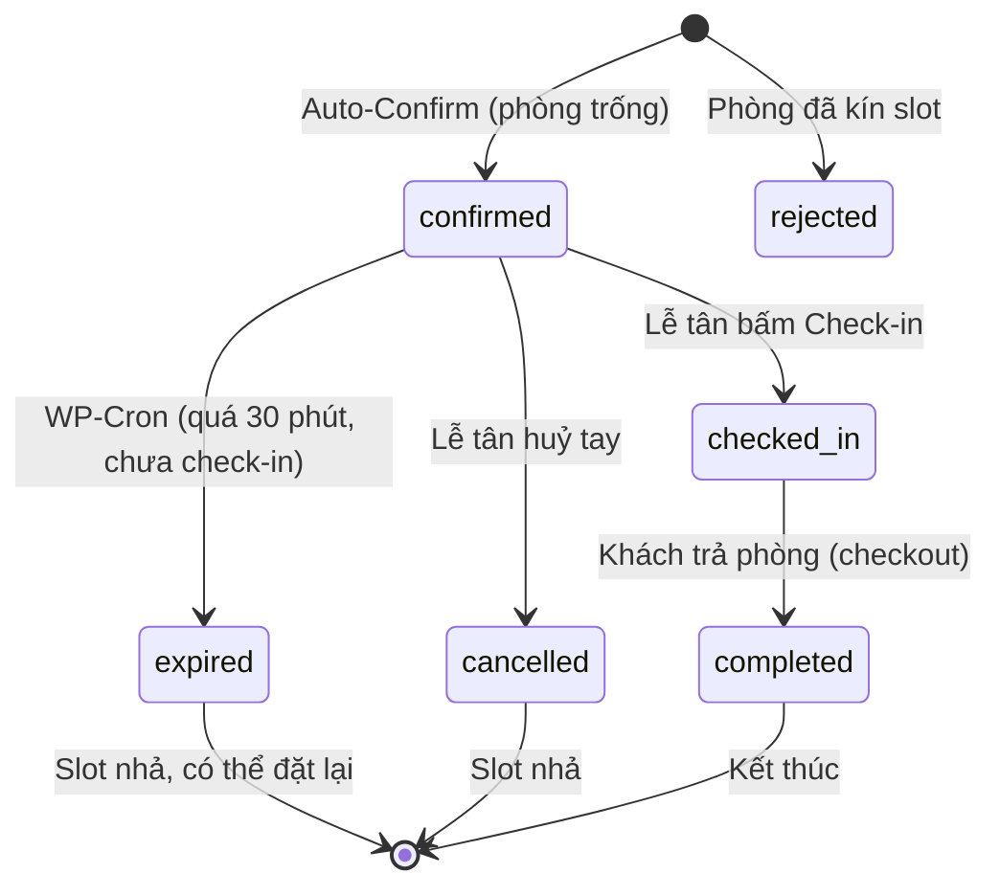

# FEATURE SPECIFICATION: 08 — AUTOMATED BOOKING ENGINE

**Feature Branch:** `feat/08-automated-booking`  
**Status:** 📋 Spec Draft — Awaiting Review  
**Tiền đề:** Feature 04 (Booking Engine & Leads) đã hoàn thành → Feature 08 nâng cấp thành hệ thống đặt phòng tự động.  
**Mục tiêu:** Chuyển đổi hệ thống đặt phòng từ chế độ "duyệt thủ công" (manual review) sang **Auto-Confirm** có kiểm tra phòng trống theo khung giờ thời gian thực, tự động tính thời lượng nghỉ, tự huỷ đơn hết hạn qua WP-Cron, mở rộng vòng đời trạng thái đơn hàng, và **sửa BUG-17 Nonce đóng băng** cho form hiện tại.

---

## 1. CLARIFICATIONS (GỠ BỎ ĐIỂM MƠ HỒ)

### Q1: Mức độ tự động hoá?
**A:** Mức 1 — **Auto-Confirm tức thì** (không cần thanh toán). Khi khách gửi form → hệ thống kiểm tra phòng trống tức thì → nếu còn slot → tự động chuyển trạng thái sang `confirmed` → gửi Telegram thông báo cho lễ tân.

### Q2: Logic kiểm tra phòng trống (Overbooking Prevention)?
**A:** Kiểm tra **cùng phòng + cùng khung giờ cụ thể** (time-range overlap). Nếu phòng X đang có đơn `confirmed` hoặc `pending` trong khoảng 14:00–16:00, khách khác đặt phòng X từ 15:00–17:00 sẽ bị từ chối (overlap detected).

### Q3: Cách xác định thời lượng nghỉ (End Time)?
**A:** Hệ thống **tự động tính End Time** dựa trên "Nhu cầu nghỉ" đã chọn:

| Nhu cầu (`booking_demand`) | Duration | Ví dụ: Check-in 14:00 → Check-out |
|:---|:---|:---|
| `2h` (Nghỉ giờ 2h đầu) | +2 giờ | 16:00 |
| `overnight` (Qua đêm 22h–12h) | Cố định 22:00–12:00 hôm sau | 12:00 D+1 |
| `allday` (Cả ngày đêm 14h–12h) | Cố định 14:00–12:00 hôm sau | 12:00 D+1 |

Admin/lễ tân có thể sửa tay check-in/check-out trong Meta Box sau khi đơn tạo.

### Q4: Xử lý khi phòng đã kín slot?
**A:** Trả lỗi thân thiện: **"Phòng đã hết trong khung giờ bạn chọn, vui lòng chọn phòng khác hoặc liên hệ hotline."** Không đề xuất phòng thay thế (giữ đơn giản).

### Q5: Kênh thông báo?
**A:** Giữ nguyên **Telegram Bot** cho lễ tân (kèm Demo Sandbox hiện tại). Không thêm kênh mới ở phiên bản này.

### Q6: Tự động huỷ đơn hết hạn (TTL)?
**A:** **Có**, dùng **WP-Cron**. Sau 30 phút (mặc định, cấu hình được qua Settings) nếu đơn vẫn `confirmed` mà lễ tân chưa chuyển sang `checked_in` → hệ thống tự động chuyển sang `expired` và nhả phòng. Thời gian giữ phòng configurable qua Settings.

---

## 2. BUG FIX ĐI KÈM (PREREQUISITE)

> ⚠️ **BUG-17: Nonce đóng băng trong Seeded Page Content** — Xem chi tiết tại `docs/booking-form-bug-report.md`

Form đặt phòng hiện **KHÔNG GỬI ĐƯỢC** do nonce bị bake vào DB khi seed, hết hạn 24h và không thể refresh. Bug này **BẮT BUỘC phải sửa trước** khi triển khai Auto-Confirm.

---

## 3. USER SCENARIOS & ACCEPTANCE CRITERIA

### US1 — Khách Đặt Phòng Tự Động Xác Nhận (Auto-Confirm) — Priority: P0

* **Given:** Khách đang ở trang chi tiết phòng Karma (CS1) hoặc trang chủ.
* **When:** Điền form: Họ tên, SĐT, chọn ngày 2026-10-05, giờ 14:00, nhu cầu "Nghỉ giờ 2h", bấm "Gửi yêu cầu giữ phòng".
* **Then:**
  1. JS gửi AJAX → PHP tính `check_out_time = 16:00`.
  2. PHP truy vấn DB: Có đơn nào `confirmed`/`pending` cho phòng Karma, CS1, overlap [14:00–16:00] ngày 05/10 không?
  3. Nếu **không trùng** → Tự động lưu với `_mixhotel_lead_status = 'confirmed'` → Bắn Telegram → Modal xác nhận xanh hiện mã đơn.
  4. Nếu **trùng** → Trả `wp_send_json_error()` với thông báo "Phòng đã hết trong khung giờ bạn chọn".
  5. Phòng Karma slot 14:00–16:00 ngày 05/10 bị lock, đơn tiếp theo đặt cùng slot sẽ bị từ chối.

### US2 — Đơn Hết Hạn Tự Động Huỷ (WP-Cron TTL) — Priority: P0

* **Given:** Đơn `#LEAD-20261005-001` trạng thái `confirmed`, tạo lúc 13:45.
* **When:** WP-Cron job chạy lúc 14:16 (> 30 phút sau khi tạo).
* **Then:**
  1. Đơn chuyển sang `expired`.
  2. Slot phòng Karma 14:00–16:00 được nhả, khách khác có thể đặt.
  3. (Tuỳ chọn) Telegram báo lễ tân đơn đã tự huỷ.

### US3 — Lễ Tân Check-in Đơn (Giữ Slot Vĩnh Viễn) — Priority: P1

* **Given:** Lễ tân mở WP Admin, thấy đơn `confirmed`.
* **When:** Bấm nút "Check-in" trong Meta Box.
* **Then:** Trạng thái chuyển sang `checked_in`, đơn không bị Cron huỷ nữa. Slot phòng giữ đến hết check-out time.

### US4 — Form Trang Chủ Hoạt Động Lại (Bug Fix) — Priority: P0

* **Given:** Khách truy cập trang chủ, form Hero hiển thị.
* **When:** Điền thông tin hợp lệ, bấm "GỬI YÊU CẦU GIỮ PHÒNG".
* **Then:** AJAX gửi thành công với nonce fresh từ `MixHotelData.nonce`, không còn lỗi "Phiên làm việc đã hết hạn".

---

## 4. VÒng ĐỜI TRẠNG THÁI ĐƠN (BOOKING LEAD STATUS LIFECYCLE)

**Các trạng thái mới so với Feature 04:**

| Status | Label VN | Mô tả |
|:---|:---|:---|
| `confirmed` | ✅ Đã xác nhận | Auto-Confirm thành công, đang giữ phòng |
| `checked_in` | 🏨 Đã nhận phòng | Lễ tân xác nhận khách đến, không bị Cron huỷ |
| `expired` | ⏰ Hết hạn giữ phòng | Quá TTL mà chưa check-in → tự huỷ |
| `no_show` | 🚫 Khách không đến | Lễ tân đánh dấu (thay thế cho cancelled) |
| `completed` | ✔️ Hoàn thành | Khách đã trả phòng |
| `cancelled` | ❌ Đã huỷ | Lễ tân hoặc khách huỷ tay |
| `pending` | ⏳ Chờ xử lý | Giữ lại cho trường hợp fallback |

---

## 5. DATA MODEL CHANGES

### 5.1. Post Meta mới cho CPT `booking_lead`

| Meta Key | Kiểu | Mục đích | Ví dụ |
|:---|:---|:---|:---|
| `_mixhotel_lead_check_in_datetime` | datetime | Thời gian nhận phòng (ngày + giờ) | `2026-10-05 14:00:00` |
| `_mixhotel_lead_check_out_datetime` | datetime | Thời gian trả phòng (tính tự động) | `2026-10-05 16:00:00` |
| `_mixhotel_lead_duration_type` | string | Loại thời lượng gốc (`2h`, `overnight`, `allday`) | `2h` |
| `_mixhotel_lead_confirmed_at` | datetime | Thời điểm auto-confirm | `2026-10-05 13:45:00` |
| `_mixhotel_lead_expired_at` | datetime | Thời điểm bị cron huỷ (nếu có) | `2026-10-05 14:16:00` |

### 5.2. WordPress Options mới

| Option Key | Kiểu | Mặc định | Mục đích |
|:---|:---|:---|:---|
| `mixhotel_hold_duration_minutes` | int | `30` | Thời gian giữ phòng (phút) trước khi cron huỷ |
| `mixhotel_auto_confirm_enabled` | bool | `1` | Bật/tắt Auto-Confirm (tắt = về chế độ pending cũ) |

---

## 6. NON-FUNCTIONAL REQUIREMENTS (NFR)

* **NFR-001 (Race Condition Prevention):** Khi 2 khách cùng đặt 1 phòng cùng lúc, sử dụng `$wpdb->query("SELECT ... FOR UPDATE")` hoặc WordPress transient lock để serialize availability check → tránh double-booking.
* **NFR-002 (Cron Reliability):** WP-Cron job đăng ký interval `mixhotel_check_expired_bookings` chạy mỗi 5 phút. Mỗi lần quét tối đa 50 đơn `confirmed` quá hạn.
* **NFR-003 (Backward Compatibility):** Các đơn `pending` cũ từ Feature 04 vẫn hoạt động bình thường. Setting `mixhotel_auto_confirm_enabled = 0` sẽ revert về flow cũ (lưu pending, lễ tân duyệt tay).
* **NFR-004 (Bảo mật):** Tuân thủ AGENTS.md §3 — Nonce, Sanitize, Escape, `$wpdb->prepare()`.
