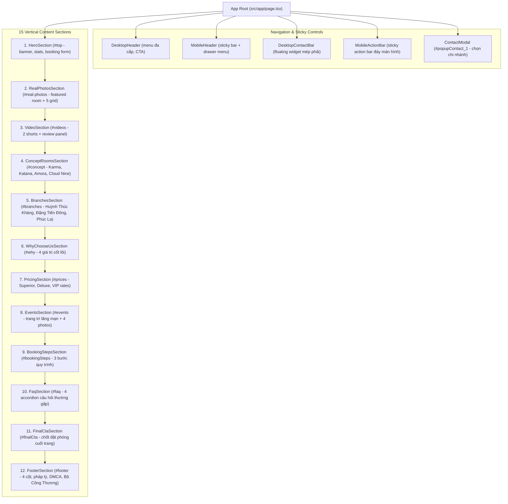

# PAGE TOPOLOGY & COMPONENT HIERARCHY: MIXHOTEL.VN

## Section Details & Data Specifications

1. **Header:** Desktop multi-level menu + Mobile fixed top bar + Drawer menu.
2. **Hero:** Full-bleed background, Dark/gold radial glow, H1 copy, 4 key stats (`3 chi nhánh`, `32+ concept`, `199k`, `Kín đáo`), mobile preview thumbnails, right booking reserve form.
3. **Real Photos:** Section kicker `Ảnh thật phòng thật`, Featured room #01 card, 5 photo grid cards (Eden BDSM, Bathtub Jacuzzi, Romantic Cosplay, Boutique mood Ghế tình yêu, Netflix & Chill).
4. **Videos:** 2 vertical shorts ("Đêm ngàn sao", "Together...") with YouTube thumbnails and custom play overlay, 1 YouTube channel showcase panel.
5. **Concept Rooms:**
   - Room 302 - Karma (Red mystery, Kamasutra ceiling art, round bed, Netflix, Cosplay)
   - VIP Room 401 - Katana (Japanese romantic, Geisha art, red lantern, BDSM, Bathtub, Tantra chair)
   - Room 402 - Amora (Nature & warm wood, starlight ceiling, garden glass view)
   - VIP Room 469 - Cloud Nine (Open bathtub, galaxy ceiling, large projector)
6. **Branches:** 3 branches with exact addresses, highlights, and individual Call & Zalo actions.
7. **Why Mix:** 4 feature cards (Riêng tư, Ảnh thật, Giá rõ, Có event).
8. **Pricing:** 3 tier cards (Superior 199k/2h, Deluxe 300k/2h, VIP 400k/2h) with full overtime, overnight, and day-night breakdown.
9. **Events:** Event decoration sets (1.490k - 1.990k, 590k, 650k, 350k) and 4-photo decor grid.
10. **Booking Steps:** Step 1 (Gửi nhu cầu) -> Step 2 (Mix xác nhận) -> Step 3 (Giữ phòng).
11. **FAQ:** 4 expandable accordion answers.
12. **Final CTA:** Re-engagement banner with dual CTA.
13. **Footer:** Company info (Linh Khanh Co.), phone, email, branch list, social links, DMCA badge, Bo Cong Thuong badge, copyright.
